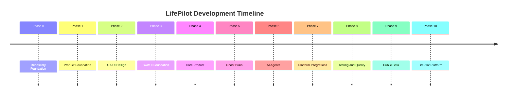
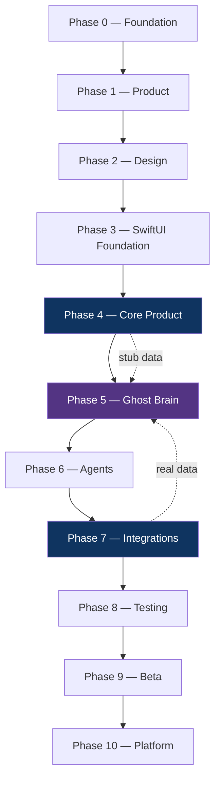
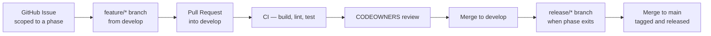

# LifePilot — Master Roadmap

**The single source of truth for LifePilot's development, from repository foundation through platform expansion.**

This document defines every phase of LifePilot's build-out: what gets built, why it exists, how it's measured, and what it depends on. It is written for engineers, designers, AI coding agents, and contributors alike — anyone picking up work on LifePilot should be able to locate exactly where a task fits by reading this file.

For the product philosophy behind these phases, see [docs/PRODUCT_VISION.md](docs/PRODUCT_VISION.md). For system design, see [docs/ARCHITECTURE.md](docs/ARCHITECTURE.md). For how work moves from idea to shipped code, see [Engineering Workflow](#engineering-workflow) below.

> **This file supersedes the earlier `ROADMAP.md`.** Phase numbering and scope have changed — see [Overall Timeline](#overall-timeline) for the current phase set.

---

> **Scope correction (2026-07-15):** Finance, shopping/commerce, and HealthKit medical intelligence are **removed** from the shipping MVP. Email content ingestion and automatic sending are not MVP dependencies. See `docs/IMPLEMENTATION_STATUS.md` and `.cursor/rules/lifepilot-mvp.mdc`. Historical Phase 6 agent roster language below is superseded for daily-life MVP delivery.

## How to read this document

Each phase follows the same template:

| Field | What it answers |
|---|---|
| **Objective** | What does this phase produce? |
| **Why this phase exists** | What breaks or stalls if we skip it? |
| **Deliverables** | The concrete artifacts that exist when this phase is done |
| **Technical Requirements** | What must be true of the code/infrastructure |
| **UX Requirements** | What must be true of the experience |
| **Success Criteria** | How we know the phase achieved its objective |
| **Risks** | What's likely to go wrong, and the mitigation |
| **Dependencies** | What must already be done before this phase can start |
| **GitHub Milestone** | The milestone this phase maps to in GitHub |
| **Related Labels** | Which `.github/labels.md` labels apply |
| **Suggested Feature Branches** | Representative `feature/*` branch names for this phase's work |
| **Estimated Sprint Count** | Rough sizing, in 2-week sprints, assuming a small core team |
| **Exit Criteria** | The explicit bar for calling this phase complete and moving on |

Sprint estimates are planning inputs, not commitments — see [Status](#project-status) for how far off they've already proven to be.

---

## Phase 0 — Repository Foundation

> Status: **Complete**

### Objective

Stand up a professional engineering repository that a team — human or AI — can immediately contribute to without tribal knowledge.

### Why this phase exists

Every phase after this one produces code, docs, or design artifacts that need somewhere disciplined to land. Skipping this phase means every subsequent contribution invents its own conventions, and the repository accumulates inconsistency from day one instead of structure.

### Deliverables

- GitHub configuration: issue templates (bug, feature, task, docs, performance, security, question), PR template, CODEOWNERS, Dependabot, labels taxonomy
- CI/CD: build, lint, test, and release workflows
- Branch strategy: Git Flow, documented and enforced via branch protection
- Engineering standards: style guide, engineering guide, API guidelines, architecture decision records
- `README.md` as the public landing page

### Technical Requirements

- All Markdown validates against project lint rules (0 errors)
- All YAML (workflows, templates, Dependabot) is syntactically valid
- Every internal documentation link resolves
- Branch protection active on `main` and `develop`: required reviews, required status checks, no force-push

### UX Requirements

*Not applicable — this phase has no user-facing surface.*

### Success Criteria

- A new contributor can read `CONTRIBUTING.md` and open a correctly-formed PR without asking a question first
- `main` cannot receive a direct commit — verified, not just documented

### Risks

| Risk | Mitigation |
|---|---|
| Documentation drifts from actual repo structure as it grows | Each doc that describes structure links to the canonical source (`docs/ARCHITECTURE.md`) rather than duplicating it |
| Required CI checks block merges before there's code to check | Accepted tradeoff — see [Phase 3](#phase-3--swiftui-foundation); resolved by giving CI a real target early |

### Dependencies

None — this is the first phase.

### GitHub Milestone

`v0.1.0 — Repository Foundation`

### Related Labels

`type: task`, `area: ci`, `status: accepted`

### Suggested Feature Branches

`feature/github-templates`, `feature/ci-workflows`, `feature/engineering-docs`

### Estimated Sprint Count

1 sprint

### Exit Criteria

- [x] All GitHub configuration merged to `main`
- [x] Branch protection verified active on `main` and `develop`
- [x] CI passing on both branches with a real (even minimal) buildable target

---

## Phase 1 — Product Foundation

> Status: **In Progress**

### Objective

Define the product completely in words and principles before a single screen is designed.

### Why this phase exists

Design and engineering decisions made without a settled product foundation get re-litigated constantly — every screen debate becomes a proxy for a vision debate that was never actually resolved. This phase forces that resolution first.

### Deliverables

- Product vision statement and belief system (`docs/PRODUCT_VISION.md`)
- Design principles (prepare-don't-perform, explain everything, orchestrate don't replace — see `docs/PRODUCT_VISION.md`)
- Brand identity: logo, mark, color and type direction (`Assets/brand/`)
- Information architecture: the full map of screens, entities, and how they relate
- User personas: who LifePilot is for, grounded in specifics, not demographics
- Core philosophy: the Observe → Understand → Predict → Prepare → Explain → Approve → Execute → Learn loop
- Success metrics: what "working" means for LifePilot, and how it's measured

### Technical Requirements

*Not applicable — this phase produces no code.*

### UX Requirements

- Information architecture accounts for every deliverable named in [Phase 4](#phase-4--core-product) and [Phase 6](#phase-6--ai-agents) — no core screen or agent should be a surprise when later phases begin
- Personas are specific enough to make a design trade-off decidable (not "busy professional," but a grounded, detailed portrait per `docs/PRODUCT_VISION.md#who-were-building-for`)

### Success Criteria

- Every subsequent phase can cite a specific principle from this phase to justify a decision, rather than inventing new rationale on the spot
- Brand identity is applied consistently across README, app icon, and website without redesign

### Risks

| Risk | Mitigation |
|---|---|
| Vision stays abstract and doesn't actually constrain later decisions | Every principle in `docs/PRODUCT_VISION.md` is written with a "how to apply" implication, not just a belief statement |
| Information architecture is designed for the MVP only and breaks under Phase 6's agent roster | IA is drafted against the full Phase 6–7 feature set, not just Phase 4's initial screens |

### Dependencies

[Phase 0](#phase-0--repository-foundation)

### GitHub Milestone

`v0.2.0 — Product Foundation`

### Related Labels

`type: documentation`, `area: design-system`

### Suggested Feature Branches

`feature/information-architecture`, `feature/user-personas`, `feature/brand-identity`

### Estimated Sprint Count

1–2 sprints

### Exit Criteria

- [x] `docs/PRODUCT_VISION.md` merged and reviewed
- [x] Brand mark finalized (`Assets/brand/logo.svg`)
- [ ] Information architecture document covering all Phase 4–7 screens
- [ ] User personas documented with specific, named scenarios

---

## Phase 2 — UX/UI Design

### Objective

Design every core experience — down to motion and micro-interaction — before implementation begins.

### Why this phase exists

SwiftUI is fast enough that it's tempting to "design in code." That trade saves time on the first screen and costs it back tenfold across the next twenty, once inconsistency compounds. Designing the full system first means Phase 3–4 engineering executes a plan instead of improvising one screen at a time.

### Deliverables

- Design system: color, typography, spacing tokens (`docs/DESIGN_SYSTEM.md`)
- Component library: cards, lists, sheets, badges, avatars
- Wireframes (low-fidelity) for every Phase 4 screen
- High-fidelity UI for every Phase 4 screen, light and dark
- Interactive prototype covering the primary user flow (open app → briefing → approve an action)
- Motion and animation system: transition timing, easing, and what motion is allowed to communicate
- Accessibility pass: Dynamic Type, VoiceOver, contrast, on every screen
- Dark mode as a first-class theme, not an inverted afterthought
- App icon and logo finalized in all required sizes
- Illustration style (if any) and icon set
- Micro-interaction spec: what animates on approve, dismiss, refresh, error

### Technical Requirements

- Every design token has a corresponding entry planned for `DesignSystem/Tokens/` ahead of Phase 3 implementation
- Component specs include states: default, loading, empty, error — not just the happy path

### UX Requirements

- Every screen supports Dynamic Type up to `accessibility3` without truncation, verified in the design file, not deferred to implementation
- Every recommendation-bearing surface has visible room for the "why," per the Core Philosophy's Explain stage
- Color is never the sole carrier of meaning (risk states pair color with icon and text)

### Success Criteria

- Engineering can implement Phase 3–4 directly from design specs without design-time decisions leaking into sprint planning
- A design review can answer "does this match the system" by checking against `docs/DESIGN_SYSTEM.md`, not by eye

### Risks

| Risk | Mitigation |
|---|---|
| Design happens ahead of real data and doesn't survive contact with actual Calendar/Mail content | Prototype is stress-tested with real (if synthetic) dense calendars and long email threads, not three-item placeholder lists |
| Motion system is designed but not specified precisely enough to implement consistently | Motion spec includes concrete duration/easing values, not just descriptive language |

### Dependencies

[Phase 1](#phase-1--product-foundation)

### GitHub Milestone

`v0.3.0 — Design System`

### Related Labels

`area: design-system`, `type: feature`

### Suggested Feature Branches

`feature/design-tokens`, `feature/component-library`, `feature/motion-system`

### Estimated Sprint Count

3–4 sprints

### Exit Criteria

- [ ] Full component library designed, light and dark
- [ ] High-fidelity UI complete for Morning Briefing, Timeline, Smart Approvals, Settings
- [ ] Interactive prototype validated against the primary user flow
- [ ] Accessibility checklist passed for every screen
- [ ] `docs/DESIGN_SYSTEM.md` updated to match final tokens

---

## Phase 3 — SwiftUI Foundation

### Objective

Build the engineering scaffolding the product will be assembled on — before assembling the product.

### Why this phase exists

Retrofitting architecture (navigation, DI, theming) under a half-built feature set is expensive and risky. This phase exists to make that architecture correct once, early, per the layering rules in `docs/ARCHITECTURE.md`.

### Deliverables

- SwiftUI project/package structure matching `docs/ARCHITECTURE.md`'s module layout
- Navigation architecture (routing, deep linking)
- MVVM pattern established with a reference implementation
- Dependency injection composition root
- Theme engine consuming Phase 2's design tokens
- Reusable component implementations (SwiftUI views matching Phase 2 specs)
- Routing and configuration (environment, feature flags if needed)
- Testing infrastructure: unit test harness, snapshot testing, CI wiring

### Technical Requirements

- `Core` and `Agents` remain UI-framework-agnostic, per [ADR](docs/DECISIONS.md) and the [Dependency Rules](docs/ARCHITECTURE.md#dependency-rules)
- Every cross-module dependency is protocol-based, per [API Guidelines](docs/API_GUIDELINES.md#internal-module-apis)
- CI's Build, Unit Tests, SwiftLint, and SwiftFormat checks pass against real application code, not just the Phase 0 placeholder package

### UX Requirements

- Navigation transitions match the motion system from Phase 2
- Theme engine produces pixel-identical output to Phase 2's high-fidelity specs in both light and dark mode

### Success Criteria

- A new screen can be added by a contributor following the reference MVVM implementation without inventing a new pattern
- 100% of Phase 2's component library has a working SwiftUI implementation

### Risks

| Risk | Mitigation |
|---|---|
| Architecture is over-engineered for an app that doesn't exist yet | Scope DI and routing to what Phase 4's actual screen count requires — see [ADR-005](docs/DECISIONS.md#adr-005-protocol-first-module-boundaries) |
| Testing infrastructure is stood up but never actually used going forward | Phase 4 exit criteria requires test coverage on every new ViewModel, enforced by CI, not just available |

### Dependencies

[Phase 2](#phase-2--uxui-design)

### GitHub Milestone

`v0.4.0 — SwiftUI Foundation`

### Related Labels

`area: core`, `type: task`, `area: ci`

### Suggested Feature Branches

`feature/navigation-architecture`, `feature/dependency-injection`, `feature/theme-engine`

### Estimated Sprint Count

2–3 sprints

### Exit Criteria

- [ ] Reference MVVM screen implemented and documented as the pattern to follow
- [ ] Theme engine renders both themes matching Phase 2 specs
- [ ] Full component library has SwiftUI implementations
- [ ] Testing infrastructure wired into CI and passing

---

## Phase 4 — Core Product

### Objective

Build the primary experience a user actually opens the app for.

### Why this phase exists

This is the product. Everything before this phase was preparation; everything after this phase (Ghost Brain, Agents) makes this experience smarter. Phase 4 has to exist and work on its own — even with simple, rule-based logic — before intelligence is layered underneath it.

### Deliverables

- Splash / launch experience
- Onboarding: permissions, first-connection flow, first briefing
- Morning Briefing screen
- Unified Timeline screen
- Memory surface (user-visible preferences and history)
- Approvals screen (Smart Approvals queue)
- Insights screen
- Settings

### Technical Requirements

- Every screen consumes data through the `Core`/`Agents` protocol boundary established in Phase 3 — no screen reaches directly into `Services` or `Integrations`
- Each screen has ViewModel unit test coverage per [Testing Strategy](docs/ENGINEERING_GUIDE.md#testing-strategy)

### UX Requirements

- Onboarding explains *why* each permission is requested, tied to a concrete feature it unlocks — not a blanket permissions dump
- Empty and loading states are designed, not default system placeholders
- Every screen matches its Phase 2 high-fidelity spec

### Success Criteria

- A first-time user reaches a populated Morning Briefing within the onboarding flow, without a dead end
- Core screens function end-to-end with rule-based logic, ahead of Ghost Brain's arrival in Phase 5 — proving the UI doesn't depend on intelligence to be usable

### Risks

| Risk | Mitigation |
|---|---|
| Team builds Core Product screens against mocked data that never matches Phase 5's real Ghost Brain output shape | Screens are built against the `Prediction`/`Recommendation` types defined in [ARCHITECTURE.md](docs/ARCHITECTURE.md#ai-agent-architecture) from day one, even while populated by stub data |
| Onboarding requests all permissions upfront, contradicting the incremental-trust principle | Permissions are requested contextually, tied to the feature that needs them, per [Product Principles](docs/PRODUCT_VISION.md#product-principles) |

### Dependencies

[Phase 3](#phase-3--swiftui-foundation)

### GitHub Milestone

`v0.5.0 — Core Product`

### Related Labels

`type: feature`, `area: core`

### Suggested Feature Branches

`feature/morning-briefing`, `feature/unified-timeline`, `feature/smart-approvals`, `feature/onboarding`

### Estimated Sprint Count

4–5 sprints

### Exit Criteria

- [ ] All eight core screens implemented and matching design spec
- [ ] Onboarding flow completes end-to-end on a clean install
- [ ] Every screen has ViewModel test coverage
- [ ] Manually verified against the golden path and at least one edge case per screen (per the project's [verify](CONTRIBUTING.md) standard)

---

## Phase 5 — Ghost Brain

### Objective

Build the intelligence layer that turns Phase 4's screens from static views into a reasoning system.

### Why this phase exists

This is what makes LifePilot an operating system rather than a well-designed dashboard. Ghost Brain is the single component responsible for fusing agent output into one coherent model of "today" — see [AI Agent Architecture](docs/ARCHITECTURE.md#ai-agent-architecture).

### Deliverables

- Context Engine: assembles the raw signal set for a given moment
- Reasoning Engine: the core fusion logic across agent outputs
- Prediction Engine: forward-looking inference (delays, conflicts, risks)
- Recommendation Engine: ranks and scores predictions into actionable suggestions
- Memory Engine: persists and retrieves long-term user context
- Approval Engine: the gate every high-risk action must pass through
- Learning Engine: incorporates outcomes and feedback into future predictions
- Explainability Engine: attaches human-readable reasoning to every recommendation

### Technical Requirements

- Ghost Brain has zero direct dependencies on any single agent's internals — only the shared `Agent` protocol, per [ADR-002](docs/DECISIONS.md#adr-002-ghost-brain-as-a-single-fusion-point-not-per-agent-orchestration)
- The Approval Engine is architecturally required for any state transition into "executed" — enforced by the type system, not convention, per [ADR-003](docs/DECISIONS.md#adr-003-no-autonomous-execution-without-explicit-approval)
- Reasoning and fusion run off the main actor; UI never blocks on inference

### UX Requirements

- Every recommendation surfaced in Phase 4's Approvals screen carries Explainability Engine output — no recommendation ships without a "why"
- Recommendation latency is fast enough that Morning Briefing doesn't feel like it's "loading AI" — target under 2 seconds for a populated briefing

### Success Criteria

- Ghost Brain produces a correct, explained prediction from at least two independent agents' signals (e.g., a calendar conflict plus a travel delay) without agent-specific logic living in Ghost Brain itself
- Learning Engine measurably changes a future prediction based on a prior approval/rejection — verified with a concrete before/after test case

### Risks

| Risk | Mitigation |
|---|---|
| Reasoning engine becomes a monolith that's hard to test in isolation | Each sub-engine (Context, Prediction, Recommendation, ...) is independently unit-testable per [Testing Strategy](docs/ENGINEERING_GUIDE.md#testing-strategy) |
| Explainability is bolted on after the fact and reasoning is opaque by the time it's added | Every prediction type carries its reasoning as a required field from the first implementation, not an optional add-on |
| Learning Engine overfits to a single user's early behavior | Defer aggressive personalization until enough approval/rejection history exists; documented threshold in Learning Engine design |

### Dependencies

[Phase 4](#phase-4--core-product)

### GitHub Milestone

`v0.6.0 — Ghost Brain`

### Related Labels

`area: core`, `type: feature`

### Suggested Feature Branches

`feature/context-engine`, `feature/reasoning-engine`, `feature/explainability-engine`

### Estimated Sprint Count

5–6 sprints

### Exit Criteria

- [ ] All eight sub-engines implemented with independent test coverage
- [ ] End-to-end reasoning demonstrated across at least two agents' combined signals
- [ ] Explainability output visible and correct in the Phase 4 Approvals screen
- [ ] Approval Engine verified to be the only path to execution (no bypass exists in code)

---

## Phase 6 — AI Agents

### Objective

Build the full roster of domain-specific agents that feed Ghost Brain.

### Why this phase exists

Ghost Brain is only as useful as the signals it receives. This phase populates the agent layer described in the README's [AI Agent System](README.md#ai-agent-system), each one independently testable and independently valuable.

### Deliverables

- Calendar Agent
- Travel Agent
- Reminder / Task Agent
- Memory Agent
- Weather Agent
- Security Agent
- Notification Agent

> **Superseded for MVP:** Email content ingestion, Finance, Shopping, and Health agents are **not** shipping. Do not implement them.

### Technical Requirements

- Every agent conforms to the shared `Agent` protocol from [API Guidelines](docs/API_GUIDELINES.md#agent-contract) — `observe()` side-effect-free, `predict(context:)` deterministic
- Agents never call each other directly; all cross-agent context flows through Ghost Brain, per [Dependency Rules](docs/ARCHITECTURE.md#dependency-rules)
- Security Agent audits every proposed action from every other agent before it reaches the Approval Engine — centralized, not duplicated per-agent

### UX Requirements

- Each agent's output is attributable in the UI (the user can see *which* agent produced a given recommendation), supporting the Explainability principle from Phase 5

### Success Criteria

- Each agent ships with its own test suite, mocking Ghost Brain as a plain context object
- Security Agent successfully blocks at least one class of synthetic high-risk action in testing before this phase is called done

### Risks

| Risk | Mitigation |
|---|---|
| Agent roster grows faster than Ghost Brain's fusion logic can meaningfully use it | Sequence agents by value: Calendar/Reminders/Travel/Weather first (highest daily-life signal density) |
| Security Agent becomes a bottleneck or a rubber stamp | Security Agent's audit logic is tested against both should-block and should-allow cases, not just happy-path approval |

### Dependencies

[Phase 5](#phase-5--ghost-brain)

### GitHub Milestone

`v0.7.0 — AI Agents`

### Related Labels

`area: agents`, `type: feature`

### Suggested Feature Branches

`feature/calendar-agent`, `feature/email-agent`, `feature/security-agent`

### Estimated Sprint Count

6–8 sprints

### Exit Criteria

- [ ] All ten agents implemented, tested, and registered with Ghost Brain
- [ ] Security Agent verified against both allow and block test cases
- [ ] Each agent's output is attributable in the Phase 4 UI

---

## Phase 7 — Platform Integrations

### Objective

Connect LifePilot's agents to the real Apple services and backend they depend on.

### Why this phase exists

Phases 5–6 can be built and tested against synthetic data, but LifePilot only becomes real once it reads an actual calendar and writes to actual reminders. This phase is where the product starts running on the user's real life.

### Deliverables

- Calendar (EventKit)
- Reminders (EventKit)
- WeatherKit
- MapKit
- Contacts
- Notifications
- CloudKit (optional sync)
- Authentication (optional account)
- ~~HealthKit~~ — deferred, not MVP
- ~~Supabase as required backend~~ — local-first; cloud optional

### Technical Requirements

- Each integration is a thin adapter behind a `Services` protocol, per [Dependency Rules](docs/ARCHITECTURE.md#dependency-rules) point 5 — swappable without touching `Core` or `Agents`
- Each integration requests only the minimum access its agent needs, per the [privacy-first architecture](SECURITY.md#our-philosophy)
- CloudKit sync is end-to-end encrypted, per [Security](SECURITY.md)

### UX Requirements

- Permission requests are contextual (tied to onboarding steps from Phase 4), never a blanket upfront dump
- Integration failures degrade gracefully — Ghost Brain reasons with partial data rather than failing the whole briefing, per [Error Handling](docs/ENGINEERING_GUIDE.md#error-handling)

### Success Criteria

- Every agent from Phase 6 is running against its real data source, not a mock
- A simulated integration outage (e.g., Calendar unreachable) degrades the Morning Briefing without crashing or blocking it

### Risks

| Risk | Mitigation |
|---|---|
| Apple framework permission changes or rate limits block a core flow | Each integration has a documented graceful-degradation path, tested explicitly |
| Supabase becomes a single point of failure for sync | CloudKit remains the primary sync path per the [Technology Stack](README.md#technology-stack); Supabase scope is auth and backend logic, not the sync critical path |

### Dependencies

[Phase 6](#phase-6--ai-agents)

### GitHub Milestone

`v0.8.0 — Platform Integrations`

### Related Labels

`area: core`, `type: feature`, `type: security`

### Suggested Feature Branches

`feature/eventkit-integration`, `feature/cloudkit-sync`, `feature/supabase-auth`

### Estimated Sprint Count

4–5 sprints

### Exit Criteria

- [ ] All ten integrations implemented behind protocol boundaries
- [ ] Graceful degradation verified for each integration's failure mode
- [ ] Least-privilege access confirmed for every integration's requested scopes

---

## Phase 8 — Testing & Quality

### Objective

Bring the full product to production-grade reliability, accessibility, and safety.

### Why this phase exists

A feature-complete app is not a shippable app. This phase is where LifePilot earns the right to be trusted with real calendars, real inboxes, and real financial signals.

### Deliverables

- Unit test coverage across all modules
- UI test coverage for critical flows (onboarding, briefing, approval)
- Performance benchmarking (launch time, scroll performance, memory)
- Accessibility audit (VoiceOver, Dynamic Type, contrast) across every screen
- Localization pass (source language plus initial target locales)
- Security audit
- Privacy audit
- Crash monitoring wired in
- Analytics (privacy-respecting, aggregate-only) wired in

### Technical Requirements

- CI enforces a minimum coverage threshold on `Core` and `Agents` (exact threshold set once baseline coverage is measured)
- Performance benchmarks are captured with Instruments and compared against Phase 4/5 baselines, per [Performance](docs/ENGINEERING_GUIDE.md#performance)
- Security and privacy audits map explicitly against [SECURITY.md](SECURITY.md)'s stated posture — audit findings that contradict the documented philosophy are release blockers

### UX Requirements

- Every screen passes VoiceOver navigation-order review, not just label-presence review
- Every screen supports Dynamic Type up to `accessibility3` without truncation, verified against the real (not synthetic) longest-content case

### Success Criteria

- Zero critical or high-severity findings open from the security and privacy audits at release
- Crash-free session rate above a defined threshold (set from beta data in [Phase 9](#phase-9--public-beta))

### Risks

| Risk | Mitigation |
|---|---|
| Testing phase reveals architecture issues that require Phase 3–5 rework | Address structural findings before shipping rather than patching symptoms — this phase can push scope back into earlier phases if needed |
| Performance regressions are found late, after months of feature work | Performance benchmarks are actually run starting in Phase 4, not deferred entirely to this phase — this phase is the hardening pass, not the first measurement |

### Dependencies

[Phase 7](#phase-7--platform-integrations)

### GitHub Milestone

`v0.9.0 — Testing & Quality`

### Related Labels

`type: performance`, `type: security`, `area: ci`

### Suggested Feature Branches

`feature/accessibility-audit`, `feature/crash-monitoring`, `feature/security-hardening`

### Estimated Sprint Count

3–4 sprints

### Exit Criteria

- [ ] Security and privacy audits complete with zero open critical/high findings
- [ ] Accessibility audit passed on every screen
- [ ] Crash monitoring and analytics live and verified in a staging build
- [ ] Performance benchmarks meet or beat targets set in this phase's technical requirements

---

## Phase 9 — Public Beta

### Objective

Prepare LifePilot for real users outside the core team.

### Why this phase exists

No amount of internal testing substitutes for a real person's actual calendar, actual inbox, and actual daily routine. This phase is where the product meets its first honest feedback loop.

### Deliverables

- Landing page
- Marketing website
- Public documentation
- Demo video
- App Store assets (screenshots, preview video, description)
- TestFlight distribution
- Feedback collection system
- Marketing materials for beta recruitment

### Technical Requirements

- Website and landing page are built and deployed per the [Technology Stack](README.md#technology-stack)'s Vercel target
- TestFlight build is signed, versioned, and traceable to a specific `main` commit per [Release Strategy](docs/ENGINEERING_GUIDE.md#release-strategy)

### UX Requirements

- App Store assets accurately represent the current product — no aspirational screenshots of unshipped features
- Feedback system is low-friction enough that beta users actually use it (in-app, not just an external form)

### Success Criteria

- A defined cohort of external beta users are actively using LifePilot for their real daily routine, not just trying it once
- Feedback volume and crash-free rate both meet thresholds defined at the start of this phase before proceeding to [Phase 10](#phase-10--lifepilot-platform)'s wider launch activities

### Risks

| Risk | Mitigation |
|---|---|
| Beta cohort is too small or too homogeneous to surface real issues | Recruit beta testers across the persona range defined in [Phase 1](#phase-1--product-foundation), not just the founding team's immediate network |
| Feedback is collected but not acted on before public release | Feedback triage is a standing item in sprint planning during this phase, not a backlog that's reviewed only at the end |

### Dependencies

[Phase 8](#phase-8--testing--quality)

### GitHub Milestone

`v0.10.0 — Public Beta`

### Related Labels

`type: documentation`, `area: web`

### Suggested Feature Branches

`feature/landing-page`, `feature/testflight-distribution`, `feature/feedback-system`

### Estimated Sprint Count

2–3 sprints

### Exit Criteria

- [ ] TestFlight build distributed to the full beta cohort
- [ ] Feedback system live and collecting structured input
- [ ] Landing page and website live
- [ ] Beta success thresholds (crash-free rate, active usage) met

---

## Phase 10 — LifePilot Platform

### Objective

Expand LifePilot beyond a single iOS app into the intelligence layer described in the README's [Future Vision](README.md#future-vision).

### Why this phase exists

The long-term thesis is that LifePilot becomes the layer underneath everyday life, not one more app competing for a place on the home screen. That ambition requires surfaces and integrations beyond what a Phase 4–9 MVP can carry alone.

### Future Vision

- Apple Watch companion
- Mac (native, not just Catalyst)
- Vision Pro
- Home screen and Lock Screen widgets
- Siri Shortcuts integration
- User-defined automation rules (the earned-autonomy step described in [Product Principles](docs/PRODUCT_VISION.md#product-principles))
- Voice interaction
- Third-party integrations beyond Apple's own frameworks
- Enterprise features (shared calendars, team-aware scheduling)
- Team collaboration surfaces
- Plugin system for third-party agents
- Agent/integration marketplace

### Technical Requirements

- New surfaces (watchOS, macOS, visionOS) reuse `Core`/`Agents` directly, per the UI-framework-agnostic boundary established in [Phase 3](#phase-3--swiftui-foundation) and [Future Scalability](docs/ARCHITECTURE.md#future-scalability)
- Third-party plugin system defines a stable, versioned contract — breaking that contract requires a major version bump per [API Guidelines](docs/API_GUIDELINES.md#stability)

### UX Requirements

- Each new surface (Watch, Vision Pro) gets its own design pass, not a naive resize of the iPhone UI
- Automation rules are opt-in and scoped per action type, never a single global "trust everything" switch, per [ADR-003](docs/DECISIONS.md#adr-003-no-autonomous-execution-without-explicit-approval)

### Success Criteria

- At least one additional surface (Watch or Mac) ships and is actively used by a meaningful share of the existing user base
- The plugin/marketplace system has at least one non-core-team integration live, proving the contract is usable by someone who didn't write it

### Risks

| Risk | Mitigation |
|---|---|
| Platform ambitions dilute focus before the core iOS product is fully proven | Phase 10 does not begin in earnest until Phase 9's beta thresholds are met — sequencing is deliberate, not parallel |
| Plugin system introduces the exact silent-execution risk the product was built to avoid | Third-party actions flow through the same Approval Engine and Security Agent as first-party agents — no privileged bypass for plugins |

### Dependencies

[Phase 9](#phase-9--public-beta)

### GitHub Milestone

`v1.0.0 — LifePilot Platform`

### Related Labels

`type: feature`, `area: web`, `priority: low`

### Suggested Feature Branches

`feature/watch-companion`, `feature/siri-shortcuts`, `feature/plugin-system`

### Estimated Sprint Count

Ongoing — this phase does not have a fixed end date

### Exit Criteria

*This phase is intentionally open-ended.* Individual deliverables within it (Watch, widgets, plugin system) each get their own milestone and exit criteria defined when that specific work is scoped, rather than one blanket bar for "the platform."

---

## Overall Timeline

```mermaid
flowchart LR
    P0[Phase 0\nRepo Foundation] --> P1[Phase 1\nProduct Foundation]
    P1 --> P2[Phase 2\nUX/UI Design]
    P2 --> P3[Phase 3\nSwiftUI Foundation]
    P3 --> P4[Phase 4\nCore Product]
    P4 --> P5[Phase 5\nGhost Brain]
    P5 --> P6[Phase 6\nAI Agents]
    P6 --> P7[Phase 7\nIntegrations]
    P7 --> P8[Phase 8\nTesting & Quality]
    P8 --> P9[Phase 9\nPublic Beta]
    P9 --> P10[Phase 10\nLifePilot Platform]
```

### Project Progress

| Phase | Status | Progress |
|---|---|---|
| 0 — Repository Foundation | Complete | `██████████` 100% |
| 1 — Product Foundation | In Progress | `███░░░░░░░` 30% |
| 2 — UX/UI Design | In Progress | `██████░░░░` 60% |
| 3 — SwiftUI Foundation | Complete | `█████████░` 90% |
| 4 — Core Product | In Progress | `████░░░░░░` 40% |
| 5 — Ghost Brain | Not Started | `░░░░░░░░░░` 0% |
| 6 — AI Agents | Not Started | `░░░░░░░░░░` 0% |
| 7 — Platform Integrations | Not Started | `░░░░░░░░░░` 0% |
| 8 — Testing & Quality | Not Started | `░░░░░░░░░░` 0% |
| 9 — Public Beta | Not Started | `░░░░░░░░░░` 0% |
| 10 — LifePilot Platform | Not Started | `░░░░░░░░░░` 0% |

### Mermaid Timeline

### Milestone Table

| Milestone | Phase | Version | Sprint Estimate |
|---|---|---|---|
| Repository Foundation | 0 | `v0.1.0` | 1 |
| Product Foundation | 1 | `v0.2.0` | 1–2 |
| Design System | 2 | `v0.3.0` | 3–4 |
| SwiftUI Foundation | 3 | `v0.4.0` | 2–3 |
| Core Product | 4 | `v0.5.0` | 4–5 |
| Ghost Brain | 5 | `v0.6.0` | 5–6 |
| AI Agents | 6 | `v0.7.0` | 6–8 |
| Platform Integrations | 7 | `v0.8.0` | 4–5 |
| Testing & Quality | 8 | `v0.9.0` | 3–4 |
| Public Beta | 9 | `v0.10.0` | 2–3 |
| LifePilot Platform | 10 | `v1.0.0`+ | Ongoing |

### Dependency Graph

The dotted lines mark the one deliberate exception to strict sequencing: **Phase 4's screens are built against Phase 5's data shapes from day one**, populated by stub data until Phase 7 connects real integrations. This lets UI and intelligence work proceed without either blocking the other, while guaranteeing they meet in a compatible shape — see the risk mitigation under [Phase 4](#phase-4--core-product).

---

## Suggested GitHub Projects

A single **LifePilot Roadmap** GitHub Project (board view), with:

- **Columns:** Backlog → Ready → In Progress → In Review → Done
- **Grouping:** by Phase (0–10), using a custom field, not just labels
- **Views:**
  - *By Phase* — board grouped by phase, for roadmap-level planning
  - *By Sprint* — board grouped by current sprint, for execution
  - *By Agent* — filtered view for Phase 6 work specifically, since agents are independently assignable

### Backlog

The backlog is every open GitHub Issue not yet assigned to a sprint. Per [CONTRIBUTING.md](CONTRIBUTING.md#issue-process), every backlog item uses one of the seven issue templates and carries at minimum a `type:` and `status:` label from [`.github/labels.md`](.github/labels.md).

### Sprint Planning

- Sprints are 2 weeks.
- Sprint planning happens at the start of each sprint, pulling from `status: accepted` issues in the current phase.
- An issue is not sprint-eligible until it has clear acceptance criteria — vague issues get refined, not pulled into a sprint half-defined.
- Mid-sprint scope changes require the issue to be re-labeled `status: blocked` with a reason, not silently dropped.

---

## Engineering Workflow

1. Work is scoped as a GitHub Issue against a phase, with acceptance criteria.
2. A `feature/*` branch is cut from `develop`, named per the phase's suggested branch patterns above.
3. Implementation follows the relevant phase's Technical and UX Requirements.
4. A Pull Request is opened against `develop` using [`.github/PULL_REQUEST_TEMPLATE.md`](.github/PULL_REQUEST_TEMPLATE.md).
5. CI (build, lint, test) must pass; CODEOWNERS review is required.
6. On merge, the branch is deleted and the issue is closed with a reference to the merged PR.

Full detail: [CONTRIBUTING.md](CONTRIBUTING.md).

## Release Workflow

1. When a phase's exit criteria are met, a `release/*` branch is cut from `develop`.
2. Release stabilization happens on the release branch — bug fixes only, no new scope.
3. The release branch merges into `main` and back into `develop`.
4. `main` is tagged with the phase's version (see [Milestone Table](#milestone-table)), triggering [`.github/workflows/release.yml`](.github/workflows/release.yml).
5. Release notes are generated from [`CHANGELOG.md`](CHANGELOG.md)'s entries for that version.

Full detail: [Release Strategy](docs/ENGINEERING_GUIDE.md#release-strategy).

## Development Lifecycle

---

## Project Status

*This section reflects the state of the project as of the last update to this file. Update it whenever phase status changes — it is the fastest way for anyone to understand "where are we" without reading the whole document.*

**Last updated:** 2026-07-09

### Current Phase

**Phase 4 — Core Product** (in progress). Phases 0 and 3 are complete. Phase 3 delivered the SwiftUI foundation: seven SPM targets, Xcode app wrapper, design system tokens and components, mock-driven screens, and CI. Phase 2 design tokens and components are implemented in code; formal wireframes and high-fidelity specs remain open.

### Current Sprint

Complete Phase 1 exit criteria (information architecture, user personas) while extending Phase 4 screens — especially Smart Approvals and polish on Home/Timeline.

### Next Sprint

Finish Phase 4 core screens, connect Ghost Brain mock seam to Approvals UI, and begin Phase 5 reasoning engine design.

### Repository Health

| Check | Status |
|---|---|
| Branch protection (`main`, `develop`) | Active |
| CI (Build, Test, Lint) | Passing on `develop` |
| Interactive web demo | Deployed to `gh-pages`; enable GitHub Pages in repo settings for `.github.io` URL |
| Vercel | `vercel.json` points to `Website/public` — merge to `main` replaces legacy `demo/` folder |
| Solo-maintainer review gap | Open — tracked in [issue #7](https://github.com/TFT444/lifepilot/issues/7) |

### Risk Assessment

| Risk | Severity | Notes |
|---|---|---|
| Solo maintainer creates a self-approval bottleneck on every PR | Medium | Tracked in #7 |
| Phase 1 IA/personas still incomplete while Phase 3–4 code landed | Medium | Complete Phase 1 docs to stabilize scope |
| GitHub Pages requires one-time enable in repo settings | Low | `gh-pages` branch and deploy workflow are ready |
| No raster app icon/favicon assets yet | Low | Tracked in [issue #2](https://github.com/TFT444/lifepilot/issues/2) |

### Upcoming Milestones

1. `v0.2.0 — Product Foundation` — information architecture and personas complete
2. `v0.4.0 — SwiftUI Foundation` — tag Phase 3 completion after Xcode simulator verification
3. `v0.5.0 — Core Product` — Smart Approvals screen and onboarding polish

### Recommended Next Actions

1. Enable GitHub Pages: **Settings → Pages → Deploy from branch → `gh-pages`**
2. Merge `develop` into `main` so Vercel production serves `Website/public`
3. Complete Phase 1 information architecture and user personas
4. Implement Smart Approvals screen (Phase 4 exit criteria)
5. Close resolved issues #3 and #4; rescope #2 (raster icons)

---

*This document is maintained alongside the codebase. Update phase status and the Project Status section in the same PR as any work that changes them — a roadmap that isn't kept current is worse than no roadmap.*
