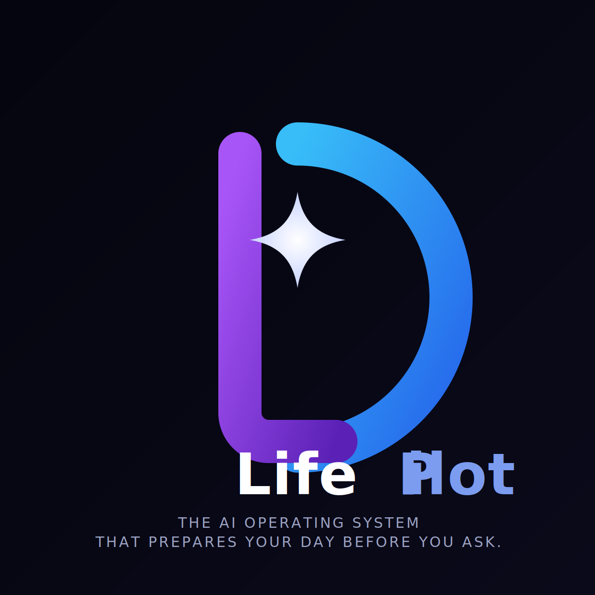
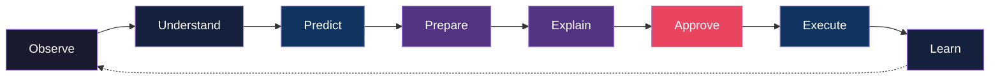
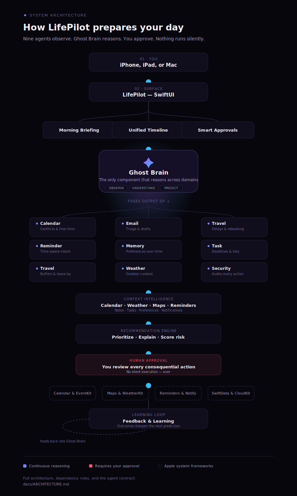
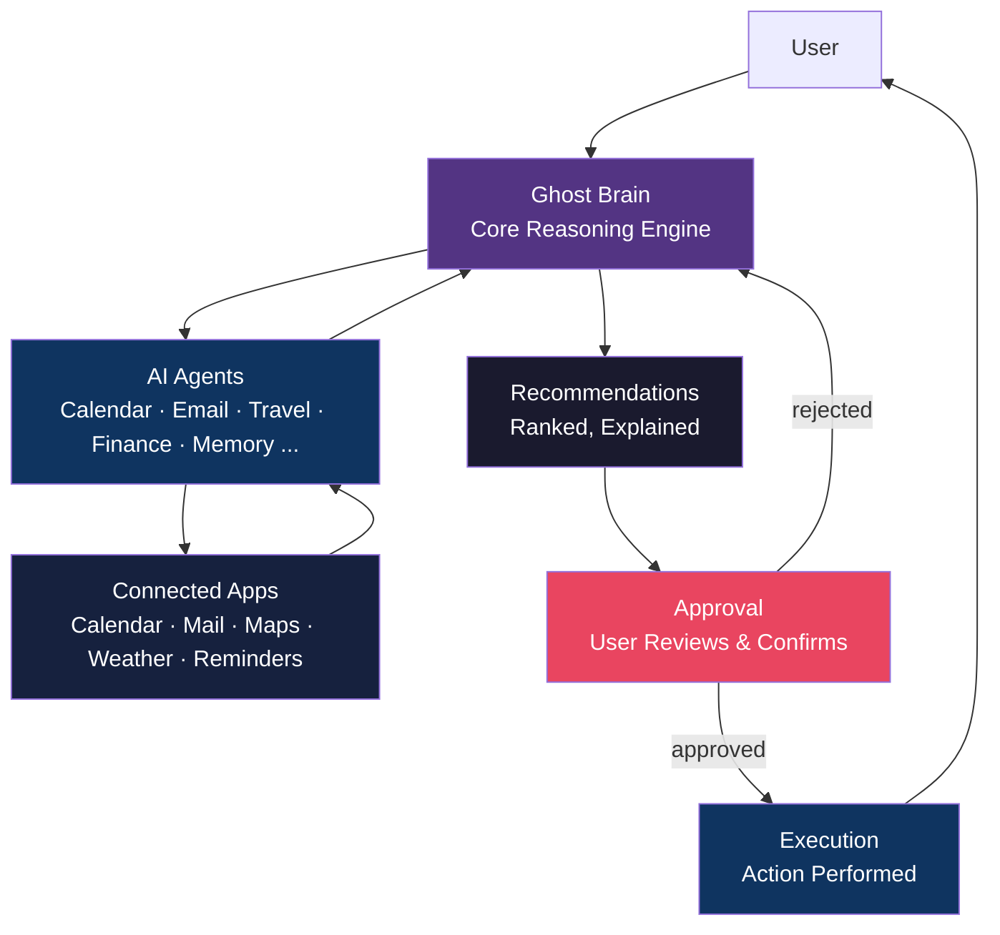
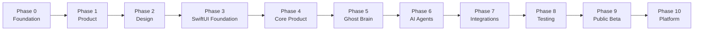
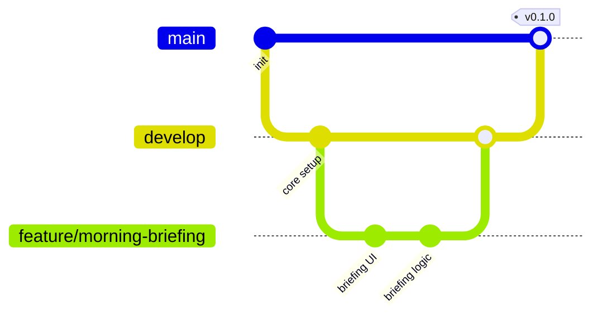

<div align="center">



# LifePilot

### The AI Operating System That Prepares Your Day Before You Ask.

Your calendar, inbox, weather, travel, and priorities — understood, predicted, and prepared by one intelligence layer, before your day begins.

[](#roadmap)
[](LICENSE)
[](#technology-stack)
[](#technology-stack)
[](#development-workflow)
[](../../stargazers)
[](#contributing)

[Introduction](#introduction) · [Architecture](#architecture-overview) · [Roadmap](#roadmap) · [Contributing](#contributing)

</div>

<br />

---

## Documentation

| Document | Purpose |
|---|---|
| [docs/PRODUCT_VISION.md](docs/PRODUCT_VISION.md) | The belief, principles, and long-term ambition behind LifePilot |
| [docs/ARCHITECTURE.md](docs/ARCHITECTURE.md) | System layers, dependency rules, and the AI agent contract |
| [docs/DESIGN_SYSTEM.md](docs/DESIGN_SYSTEM.md) | Color, typography, spacing, and component tokens |
| [docs/ENGINEERING_GUIDE.md](docs/ENGINEERING_GUIDE.md) | MVVM, testing, error handling, logging, accessibility, performance |
| [docs/API_GUIDELINES.md](docs/API_GUIDELINES.md) | Internal module contracts and the future external API |
| [docs/STYLE_GUIDE.md](docs/STYLE_GUIDE.md) | Swift conventions enforced by SwiftLint and SwiftFormat |
| [docs/DECISIONS.md](docs/DECISIONS.md) | Architecture decision records — the "why" behind hard-to-reverse choices |
| [MASTER_ROADMAP.md](MASTER_ROADMAP.md) | The eleven phases from repository foundation to platform, with full technical/UX requirements per phase |
| [CONTRIBUTING.md](CONTRIBUTING.md) | Branching, commits, PR process, and review expectations |
| [CODE_OF_CONDUCT.md](CODE_OF_CONDUCT.md) | Community standards and enforcement |
| [SECURITY.md](SECURITY.md) | Supported versions and vulnerability disclosure |
| [CHANGELOG.md](CHANGELOG.md) | Notable changes, release by release |

---

## Introduction

**LifePilot is an AI operating system for everyday life.**

Every morning, the average person opens six or seven apps just to understand what their day looks like — a calendar for meetings, email for what needs a response, a weather app to decide what to wear, a maps app to check the commute, a notes app for what they meant to remember, and a messages app for what's still waiting on them. Each app is competent in isolation. None of them talk to each other. The person is left to do the integration work — manually, every single day.

LifePilot exists to remove that work.

It sits above the apps a person already uses, continuously observing what's relevant, understanding how it connects, predicting what will matter today, and preparing a briefing and a set of recommended actions — before the user has to ask. Nothing executes without explicit approval. LifePilot prepares; the user decides.

**Who it's for.** LifePilot is built for people whose day is assembled from many independent systems — professionals managing dense calendars, founders context-switching across tools, and anyone who has felt the specific fatigue of re-deriving "what does today actually require of me" from scratch each morning.

**Why today's approach is broken.** The current model of productivity software is reactive by design: apps wait to be opened, notifications wait to be triaged, and the burden of synthesis — turning ten disconnected signals into one coherent plan — falls entirely on the human. That synthesis work is cognitive overhead that scales with how many tools a person's life depends on, and in 2026, that number only grows.

**Why proactive AI is the future.** Large language models have made it possible for software to understand context, not just display it. The next generation of personal software won't be a better inbox or a smarter calendar — it will be a layer that reads across all of them, reasons about what matters, and does the preparation work automatically. LifePilot is built on that premise from day one.

LifePilot is not another chatbot bolted onto a to-do list. **It is an operating system for daily life** — with its own architecture, memory, agents, and execution model.

---

## The Problem

Modern digital life is fragmented across systems that were never designed to talk to each other:

| Domain | Where it lives today |
|---|---|
| Schedule | Calendar app |
| Communication | Email, Messages |
| Navigation | Maps |
| Conditions | Weather |
| Thoughts | Notes |
| Obligations | Tasks / Reminders |
| Money | Banking apps |
| Movement | Travel / booking apps |

Each of these systems is a silo. Each requires a separate mental model, a separate check-in, a separate moment of context-switching. None of them know that a 9 AM flight delay affects a 10 AM meeting, that a calendar conflict should trigger an email reply, or that rain this afternoon should move an outdoor lunch indoors.

The result is **cognitive overhead by design**: the user becomes the integration layer, manually cross-referencing eight applications every day just to answer one question — *"What does today actually require of me?"*

This doesn't scale with the complexity of modern life, and it gets worse, not better, as more tools get added to the stack.

---

## The Solution

LifePilot introduces a single intelligent layer that sits above the tools a person already relies on.

**LifePilot does not replace apps. It orchestrates them.**

It reads context from the systems already in use — calendar, email, maps, weather, notes, reminders — reasons over that context as a whole, and produces a single, coherent understanding of the day. Where existing apps stop at *displaying* information, LifePilot goes further: it *connects* the information, *predicts* what will matter, and *prepares* a plan, surfacing recommended actions the user can approve with a tap.

The philosophy is deliberate: augment the existing ecosystem, don't fight it. Calendar apps stay the source of truth for events. Email stays the source of truth for messages. LifePilot becomes the source of truth for *what it all means, together*.

---

## Core Philosophy

Every feature in LifePilot is an expression of one loop:



| Stage | Description |
|---|---|
| **Observe** | Continuously and securely reads signals across connected apps — calendar events, emails, location, weather, reminders. |
| **Understand** | Builds a structured model of the day: what's happening, what depends on what, and what's at risk. |
| **Predict** | Reasons ahead — flight delays, weather changes, scheduling conflicts, likely follow-ups — before they become problems. |
| **Prepare** | Assembles a morning briefing and a queue of recommended actions, ranked by relevance and urgency. |
| **Explain** | Every recommendation comes with plain-language reasoning. No black-box actions. |
| **Approve** | Nothing executes without the user's explicit sign-off. LifePilot proposes; it does not presume. |
| **Execute** | Once approved, LifePilot carries out the action through the relevant connected app or agent. |
| **Learn** | Outcomes and preferences feed back into the model, sharpening future predictions. |

This loop — not a chat window — is the product.

---

## Features

| Feature | Description |
|---|---|
| **Morning Briefing** | A single, generated summary of the day — schedule, priorities, weather, travel, and flagged risks — ready before the user wakes up. |
| **Timeline** | A unified, chronological view of everything happening across every connected app, merged into one stream. |
| **Memory** | Long-term context about the user's preferences, routines, and relationships, used to make every prediction more personal over time. |
| **Smart Approvals** | A single queue of recommended actions, each with reasoning attached, approved or dismissed with one tap. |
| **Context Awareness** | Understands relationships between events — a delayed flight affects a meeting; a cancelled meeting frees up focus time. |
| **Predictive Planning** | Surfaces conflicts, risks, and opportunities before they happen, not after. |
| **AI Agents** | Domain-specific agents (calendar, email, travel, finance, and more) that reason within their domain and report to the core system. |
| **Insights** | Patterns in how the user spends time, communicates, and plans — surfaced as periodic, actionable summaries. |
| **Automation** | Optional, user-defined rules that let low-risk, high-confidence actions execute without manual approval. |
| **Privacy** | On-device processing wherever possible, end-to-end encryption for synced data, and zero silent execution. |

---

## Product Preview

> **Interactive demo:** [lifepilot demo on GitHub Pages](https://tft444.github.io/lifepilot/) · [CDN mirror](https://cdn.jsdelivr.net/gh/TFT444/lifepilot@gh-pages/index.html)  
> Splash → Onboarding → Morning Briefing → Timeline. Mock data from Phase 3.  
> If the Pages link 404s, enable **Settings → Pages → `gh-pages` branch** once.

| Morning Briefing (iPhone) | Timeline (Desktop) |
|:---:|:---:|
| *Use the [interactive demo](https://cdn.jsdelivr.net/gh/TFT444/lifepilot@gh-pages/index.html)* | *Same demo — toggle theme in header* |

| Dark Mode | Smart Approvals |
|:---:|:---:|
| *Toggle in demo header* | *Approve/Dismiss on Home screen* |

---

## Architecture Overview

LifePilot is structured as a layered system: signal collection at the edges, reasoning at the core, and execution gated behind explicit human approval.

<div align="center">



**[View the animated walkthrough →](https://claude.ai/code/artifact/42b476cf-34a1-4408-9479-5eb42bc7da69)**

</div>

The Mermaid diagram below is the same architecture in a more compact, text-searchable form:



**Ghost Brain** is the core reasoning engine — the system that fuses signals from every agent into one model of "today," produces predictions, and ranks recommendations. It is deliberately decoupled from any single app integration, so new agents and data sources can be added without changing the reasoning core.

No execution step is reachable without passing through **Approval**. This is an architectural guarantee, not a UI convention.

---

## AI Agent System

LifePilot's intelligence is composed of specialized agents, each responsible for reasoning within one domain and reporting structured findings to the Ghost Brain.

| Agent | Responsibility |
|---|---|
| **Calendar Agent** | Reads events, detects conflicts, identifies free time, and flags scheduling risk. |
| **Email Agent** | Triages messages by urgency, drafts suggested replies, and surfaces items needing a decision. |
| **Travel Agent** | Tracks flights and reservations, predicts delays, and recalculates itineraries in real time. |
| **Finance Agent** | Monitors spending patterns and upcoming bills, and flags anomalies worth attention. |
| **Memory Agent** | Maintains long-term context — preferences, relationships, routines — shared across all agents. |
| **Reminder Agent** | Converts stated and inferred intentions into time-aware, prioritized reminders. |
| **Shopping Agent** | Tracks recurring needs and price-sensitive purchases, and prepares — never places — orders. |
| **Health Agent** | Correlates sleep, activity, and schedule density to recommend realistic, sustainable plans. |
| **Security Agent** | Audits every proposed action for risk before it reaches the Approval queue. |
| **Ghost Brain** | The orchestrator. Fuses every agent's output into one coherent model of the day and ranks what matters. |

Each agent is independently testable and independently replaceable — a deliberate design choice that keeps the system extensible as new domains (health, home, finance) come online.

---

## Repository Structure

```
lifepilot/
├── App/                       # SwiftUI application entry point, scenes, app icon
├── Core/                      # Ghost Brain reasoning engine and shared domain models
├── Agents/                    # Domain-specific AI agents
│   ├── CalendarAgent/
│   ├── EmailAgent/
│   ├── TravelAgent/
│   ├── FinanceAgent/
│   ├── MemoryAgent/
│   ├── ReminderAgent/
│   ├── ShoppingAgent/
│   ├── HealthAgent/
│   └── SecurityAgent/
├── DesignSystem/              # Shared UI components, typography, tokens, theming
├── Features/                  # User-facing feature modules (Morning Briefing, Timeline, ...)
├── Services/                  # Cross-cutting infrastructure: networking, persistence, auth
├── Resources/                 # Localization and configuration
├── Assets/
│   └── brand/                 # LifePilot logo and mark — source of truth for all derived icons
├── Tests/                     # Unit and integration tests, mirroring the structure above
├── Examples/                  # Minimal, runnable examples of agent and service usage
├── Scripts/                   # Developer tooling: setup, codegen, release scripts
├── packages/                  # Local Swift Packages shared across targets
├── Website/                   # Companion marketing/web dashboard (future)
├── docs/                      # Architecture, product, and engineering documentation
├── .github/
│   ├── ISSUE_TEMPLATE/        # Bug, feature, task, docs, performance, security, question
│   ├── workflows/             # CI pipelines: build, lint, test, release
│   ├── CODEOWNERS
│   └── PULL_REQUEST_TEMPLATE.md
├── CONTRIBUTING.md
├── CODE_OF_CONDUCT.md
├── SECURITY.md
├── MASTER_ROADMAP.md
├── CHANGELOG.md
├── LICENSE
└── README.md
```

Full explanation of every directory, the dependency rules between them, and the layered architecture they express lives in [docs/ARCHITECTURE.md](docs/ARCHITECTURE.md).

---

## Technology Stack

| Layer | Technology | Purpose |
|---|---|---|
| Client UI | **SwiftUI** | Native iOS and macOS interface |
| Development | **Cursor**, **Claude Code** | AI-assisted engineering workflow |
| Backend | **Supabase** | Auth, database, and sync infrastructure |
| Intelligence | **OpenAI** | Core reasoning and language understanding |
| Sync | **CloudKit** | Cross-device state and offline continuity |
| Context | **WeatherKit** | Weather-aware predictions |
| Context | **MapKit** | Location, travel time, and routing awareness |
| CI/CD | **GitHub Actions** | Automated build, test, and release pipelines |
| Web (future) | **Vercel** | Companion web dashboard and marketing site |

---

## Roadmap

LifePilot's roadmap spans eleven phases, from repository foundation to platform. Each phase has a concrete, demonstrable outcome, full technical and UX requirements, risks, and exit criteria — see [MASTER_ROADMAP.md](MASTER_ROADMAP.md) for the complete breakdown.



| Phase | Focus | Outcome |
|---|---|---|
| **0 — Repository Foundation** | Engineering foundation: CI/CD, templates, documentation. | A new contributor can open a correct PR within an hour. |
| **1 — Product Foundation** | Vision, principles, brand, information architecture. | Every later decision can cite a settled principle. |
| **2 — UX/UI Design** | Design system and every core screen, before code. | Engineering executes a plan instead of improvising per screen. |
| **3 — SwiftUI Foundation** | Navigation, MVVM, DI, theming, test infrastructure. | A new screen follows an established pattern, not a new one. |
| **4 — Core Product** | Briefing, Timeline, Approvals, Insights, Settings. | The app is usable end-to-end on rule-based logic alone. |
| **5 — Ghost Brain** | The reasoning engine: context, prediction, explainability. | A recommendation is produced, ranked, and explained. |
| **6 — AI Agents** | The full nine-agent roster feeding Ghost Brain. | Each agent is independently tested and attributable in the UI. |
| **7 — Platform Integrations** | Real Calendar, Mail, Health, CloudKit, Supabase. | Every agent runs on real data, not mocks. |
| **8 — Testing & Quality** | Security, privacy, accessibility, performance audits. | Zero open critical findings at release. |
| **9 — Public Beta** | TestFlight, landing page, feedback loop. | External users rely on LifePilot for their actual day. |
| **10 — LifePilot Platform** | Watch, Mac, widgets, automation, plugins. | The intelligence layer described in [Future Vision](#future-vision). |

---

## Development Workflow

LifePilot follows [Git Flow](https://nvie.com/posts/a-successful-git-branching-model/), documented in full in [CONTRIBUTING.md](CONTRIBUTING.md).

1. Work begins on a **feature branch**, cut from `develop`.
2. Changes are proposed via **Pull Request** into `develop`, using the [PR template](.github/PULL_REQUEST_TEMPLATE.md).
3. Every PR requires **code review** (see [CODEOWNERS](.github/CODEOWNERS)) and passing CI (build, lint, test — see [`.github/workflows/`](.github/workflows/)) before merge.
4. `develop` is periodically merged into `main` as part of a **release**, following [Semantic Versioning](docs/ENGINEERING_GUIDE.md#release-strategy).
5. Releases are tagged from `main`, triggering [`release.yml`](.github/workflows/release.yml).



Commit messages follow [Conventional Commits](CONTRIBUTING.md#commit-messages) (`feat(home): add morning briefing dashboard`), which power automated changelog generation — see [CHANGELOG.md](CHANGELOG.md).

---

## Branch Strategy

| Branch | Purpose | Rules |
|---|---|---|
| `main` | Always stable, always releasable. Protected. | No direct commits. Updated only via merge from `develop` or `hotfix/*`. |
| `develop` | Default working branch, active development. | All feature branches start and merge here. |
| `feature/*` | One feature, one Pull Request. | Branched from `develop`, merged back via Pull Request. |
| `hotfix/*` | Urgent fixes to production. | Branched from `main`, merged into both `main` and `develop`. |
| `release/*` | Release stabilization. | Branched from `develop`, merged into `main` and back into `develop`. |

**Everything is merged through Pull Requests.** Direct pushes and force-pushes to `main` or `develop` are disabled by branch protection rules, and merges require a passing CI run and at least one approving review. This keeps history reviewable and every change traceable to a discussion. Full detail in [CONTRIBUTING.md](CONTRIBUTING.md#branch-naming).

---

## Contributing

LifePilot is an early-stage project and early contributors have outsized influence on its architecture and direction. The full guide — branch naming, commit conventions, PR process, and review expectations — lives in [CONTRIBUTING.md](CONTRIBUTING.md).

1. **Fork** the repository and clone your fork locally.
2. Create a feature branch from `develop` (see [branch naming](CONTRIBUTING.md#branch-naming)).
3. Make your changes with clear, [Conventional Commits](CONTRIBUTING.md#commit-messages).
4. Ensure the project builds, lints, and existing tests pass.
5. Open a **Pull Request** against `develop` using the [PR template](.github/PULL_REQUEST_TEMPLATE.md).
6. Respond to review feedback — most PRs go through at least one round of revision.

Before contributing a substantial feature, please open an issue first using one of the [issue templates](.github/ISSUE_TEMPLATE/) to discuss scope and approach. All contributors are expected to follow the [Code of Conduct](CODE_OF_CONDUCT.md). All contributions are made under the terms of the project's [MIT License](LICENSE).

---

## Security

LifePilot is designed privacy-first, from data handling to execution. Full policy, supported versions, and the vulnerability disclosure process live in [SECURITY.md](SECURITY.md).

- **On-device by default.** Reasoning and data processing happen on-device wherever feasible; nothing is sent off-device that doesn't need to be.
- **Encrypted sync.** Any data synced across devices is end-to-end encrypted via CloudKit.
- **No silent execution.** LifePilot never performs a high-risk action — sending a message, making a booking, moving money — without explicit, per-action user approval. This is enforced architecturally — see [ARCHITECTURE.md](docs/ARCHITECTURE.md#dependency-rules).
- **Least-privilege integrations.** Each connected app is granted the minimum access required for its agent to function.
- **Auditable actions.** Every executed action is logged with the reasoning that produced it, visible to the user at any time.

If you discover a security vulnerability, do not open a public issue — follow the private disclosure process in [SECURITY.md](SECURITY.md).

---

## Future Vision

LifePilot's long-term goal is not to be one more app on the home screen. It is to become the intelligence layer underneath every app on the home screen — the system that already knows what today requires, before the phone is even unlocked.

One dashboard. One AI. One place where a fragmented digital life becomes a single, coherent, prepared day.

Calendars, inboxes, and maps will still exist. LifePilot's ambition is that a person will need to open them less and less — because the layer above them already did the work.

---

## License

LifePilot is released under the [MIT License](LICENSE).

<div align="center">

<br />

**Built by [Tanvir Farhad](https://github.com/TFT444) and the LifePilot open-source community.**

</div>
