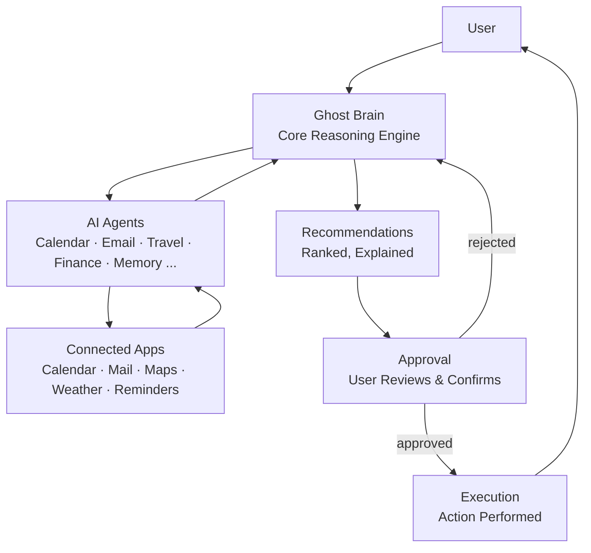
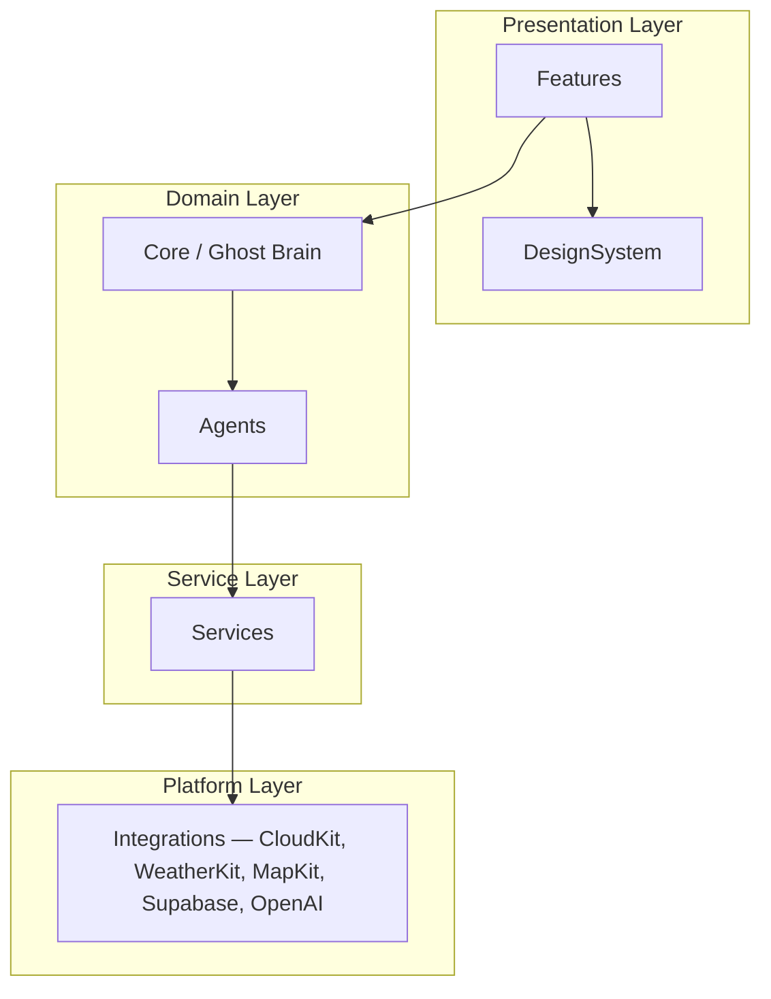
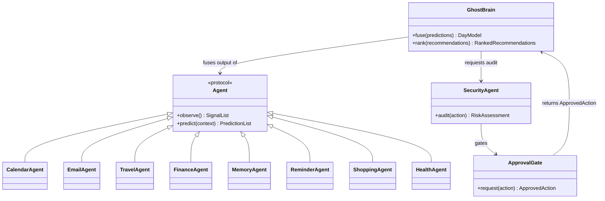

# Architecture

This document describes LifePilot's system architecture: how the codebase is organized, how layers depend on one another, how the AI agent system is structured, and how the design scales as the product grows.

## Table of Contents

- [System Overview](#system-overview)
- [Folder Structure](#folder-structure)
- [Layered Architecture](#layered-architecture)
- [Dependency Rules](#dependency-rules)
- [AI Agent Architecture](#ai-agent-architecture)
- [Future Scalability](#future-scalability)

## System Overview

LifePilot is structured as a layered system: signal collection at the edges, reasoning at the core, and execution gated behind explicit human approval. This is a direct expression of the product's core loop — **Observe → Understand → Predict → Prepare → Explain → Approve → Execute → Learn** — described in the [README](../README.md#core-philosophy).



Three properties fall directly out of this diagram:

1. **The Ghost Brain is the only component that reasons across domains.** Agents reason within their domain and report structured findings upward; only the Ghost Brain fuses them into one model of "today."
2. **No path reaches Execution without passing through Approval.** This is enforced in code, not just in the UI — see [Dependency Rules](#dependency-rules).
3. **Connected Apps are adapters, not sources of truth for meaning.** LifePilot never forks the user's data model; it reads from and writes back to the systems of record.

## Folder Structure

```
lifepilot/
├── App/                      # SwiftUI application entry point, scenes, app icon
├── Core/                     # Ghost Brain reasoning engine and shared domain models
├── Agents/                   # Domain-specific AI agents (Calendar, Email, Travel, ...)
├── DesignSystem/             # Shared UI components, typography, tokens, theming
├── Features/                 # User-facing feature modules (Morning Briefing, Timeline, ...)
├── Services/                 # Cross-cutting infrastructure: networking, persistence, auth
├── Resources/                # Assets, localization, configuration
├── Assets/                   # Brand assets (logo, marks) — source of truth for all derived icons
├── Tests/                    # Unit and integration tests, mirroring the module structure above
├── Examples/                 # Minimal, runnable examples of agent and service usage
├── Scripts/                  # Developer tooling: setup, codegen, release scripts
├── packages/                 # Local Swift Packages shared across App and future targets
├── Website/                  # Companion marketing/web dashboard (future)
├── docs/                     # Architecture, product, and engineering documentation
└── .github/                  # Issue templates, PR template, CI/CD workflows
```

Each first-class module (`Core`, `Agents`, `DesignSystem`, `Features`, `Services`) is expected to be internally organized by feature, not by file type — e.g. `Agents/CalendarAgent/CalendarAgent.swift`, `Agents/CalendarAgent/CalendarSignal.swift`, `Agents/CalendarAgent/Tests/`, rather than a flat `Models/`, `Views/`, `Controllers/` split at the top level.

The root `Package.swift` currently builds `Core` as the `LifePilotCore` library target — the first buildable unit, giving CI a real target ahead of the full iOS app (tracked in [#4](https://github.com/TFT444/LifePilot/issues/4)). `packages/` remains reserved for domain logic *extracted* from `Core` once it outgrows a single target, per [ADR-005](DECISIONS.md#adr-005-protocol-first-module-boundaries) — the two are not redundant, just different stages of the same growth path.

## Layered Architecture

LifePilot follows a strict layering model. Each layer may depend only on the layers below it.



| Layer | Responsibility | May depend on |
|---|---|---|
| **Presentation** (`Features`, `DesignSystem`) | Renders UI, handles user interaction, presents Ghost Brain output. | Domain layer only. Never talks to Services or Integrations directly. |
| **Domain** (`Core`, `Agents`) | Reasoning, prediction, and domain modeling. Framework-agnostic. | Service layer, via protocols. |
| **Service** (`Services`) | Cross-cutting infrastructure: networking, persistence, auth, logging. | Platform layer. |
| **Platform** (`Integrations`) | Thin adapters around external SDKs and APIs. | Nothing above it. |

## Dependency Rules

1. **Dependencies point downward only.** `Features` may import `Core`; `Core` must never import `Features`. Circular dependencies between modules are a build failure, not a style preference.
2. **The Domain layer is UI-framework-agnostic.** `Core` and `Agents` contain no `import SwiftUI`. This keeps the reasoning engine testable in isolation and portable to a future non-Apple surface if the product ever requires it.
3. **Agents communicate only through the Ghost Brain.** `Agents/CalendarAgent` never directly calls `Agents/EmailAgent`. Cross-agent context flows through `Core`, so the reasoning graph stays inspectable and testable as a whole.
4. **Execution is gated by construction.** The type that represents an "approved action" is only constructible from a successful Approval flow — see [Core Philosophy](../README.md#core-philosophy) and the Security Agent's role in [AI Agent Architecture](#ai-agent-architecture). There is no code path that produces a side effect without passing through that type.
5. **Integrations are swappable.** `Services` depends on protocols, not concrete SDK types, so `OpenAI`, `Supabase`, or `CloudKit` can be replaced or mocked without touching `Core` or `Agents`.

## AI Agent Architecture

Each agent is a self-contained unit that reasons within one domain and reports structured, typed findings to the Ghost Brain. This mirrors the [AI Agent System](../README.md#ai-agent-system) described in the README, with the following structural contract:



Each agent implements a common `Agent` protocol (`observe()`, `predict(context:)`), which means:

- New agents can be added without modifying the Ghost Brain's core fusion logic.
- Every agent is independently unit-testable, with the Ghost Brain mocked as a simple context object.
- The `SecurityAgent` is architecturally distinct from domain agents — it doesn't propose actions, it audits *other agents'* proposed actions before they reach the Approval Gate. This keeps the "is this action safe" question centralized and auditable rather than duplicated per-agent.

See the [README's AI Agent System](../README.md#ai-agent-system) for what each agent is responsible for at the product level.

## Future Scalability

The layering and agent contracts above are designed to absorb three kinds of future growth without rearchitecting:

- **New agents.** Home, Social, and Work agents can be added by implementing `Agent` and registering with the Ghost Brain — no changes to `Features` or `DesignSystem` required.
- **New surfaces.** Because `Core` and `Agents` are UI-framework-agnostic, a future web dashboard (`Website/`) or other client can reuse the same reasoning engine through a thin API layer rather than reimplementing it.
- **New integrations.** Because `Services` depends on protocols rather than concrete SDKs, swapping or adding a data source (e.g. a new calendar provider) touches one adapter, not the reasoning core.

As the codebase grows past what a single `Core` module can comfortably hold, domain logic will be extracted into local Swift Packages under `packages/`, each with its own tests and versioned independently — without changing the dependency rules above.
