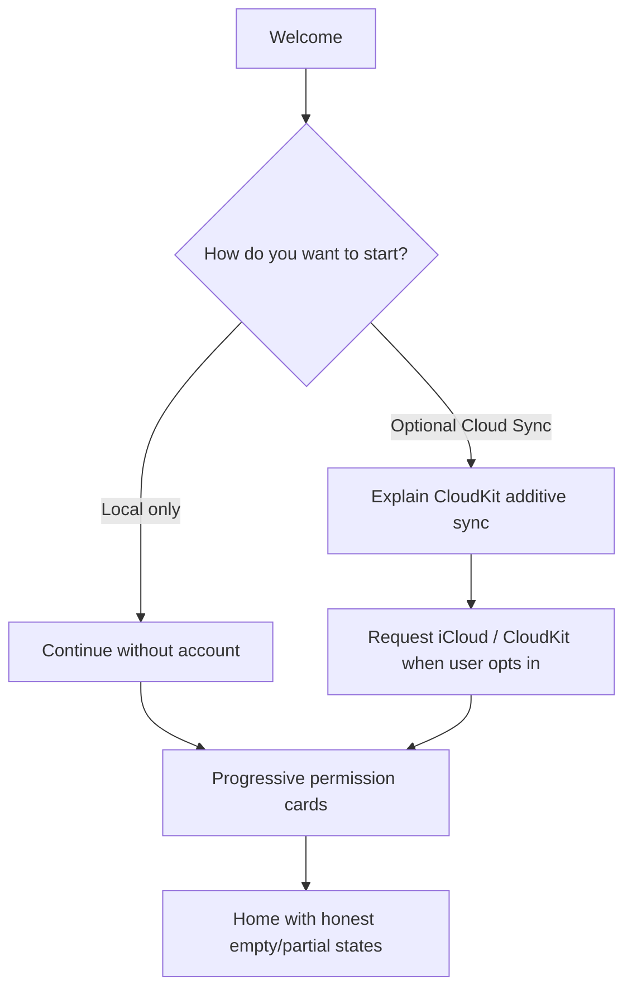

# Onboarding and Permissions

**Issue:** [#29](https://github.com/TFT444/LifePilot/issues/29)  
**Related:** [USER_JOURNEYS.md](USER_JOURNEYS.md), [WIREFRAMES.md](WIREFRAMES.md), [ACCESSIBILITY_NOTIFICATIONS.md](ACCESSIBILITY_NOTIFICATIONS.md)

Progressive permission education for the daily-life MVP. No blanket dump. No system prompt without preceding in-app context.

## Scope of MVP permissions

| Capability | Why LifePilot asks | Feature unlocked |
|---|---|---|
| **Calendar** (EventKit) | Read schedule; write only after Approve | Morning Briefing density, Timeline events, conflict proposals |
| **Reminders** (EventKit) | Read/write reminders via proposals | Due items, preparation nudges syncing to Reminders |
| **Notifications** | Time-sensitive alerts | Leave-by, overdue, briefing ready |
| **Location** | Travel-time / place context | Buffer warnings, place-aware memory |
| **Weather** (WeatherKit) | Forecast tied to outdoor / travel plans | Briefing weather strip, reschedule suggestions |
| **Cloud Sync** (CloudKit, optional) | Additive multi-device | Same local data on another Apple device |

### Not requested in MVP

- **Health / HealthKit** — deferred future opt-in only. Do not show in primary onboarding. May appear later under Settings → Advanced as “Coming later — optional health context,” never as a required step.
- **Apple Mail** — no ingestion, no auto-send. Do not request Mail access in onboarding.
- **Finance / shopping connectors** — out of scope permanently.

---

## Account vs local-only

| Mode | What is true |
|---|---|
| **Local-only (default)** | Full LifePilot-owned tasks, memory, preferences, approvals history on device. No account required. Calendar/Reminders remain optional system connections. |
| **Cloud Sync (opt-in)** | Additive; never required for first briefing. Failure falls back to local. Denial/skip keeps local-only without shame copy. |

AI enhancement (if ever enabled) is separate, off by default, and **never** receives execution credentials — see MVP rules and [ARCHITECTURE.md](../ARCHITECTURE.md).

---

## Progressive education pattern

For each capability:

1. **Context screen** — value in one sentence tied to a concrete feature (“Catch calendar overlaps before your morning briefing”).
2. **Guarantees** — read vs write; writes need Approve; sensitive notification previews off by default.
3. **User choice** — Connect / Not now.
4. **Only then** — system permission dialog (OS).
5. **Aftermath** — success state **or** reduced-functionality explanation + Settings path.

**Rule:** Skip / Not now never traps the user. First briefing is always reachable.

### Suggested first-run order

1. Welcome + product promise (prepare, explain, approve).
2. Account vs local-only (Cloud Sync optional, skippable).
3. Calendar (highest briefing value).
4. Notifications (after user sees a reminder example in UI copy).
5. Reminders (if user captured a task that benefits from system Reminder).
6. Location then Weather (contextual — can defer until first travel-buffer card).
7. You’re in control + first Home.

Health is **absent** from this list. Mail is **absent**.

---

## Per-permission cards

### Calendar

- **Education:** “LifePilot reads events to prepare your day and propose changes. Nothing moves on your calendar until you Approve.”
- **Skip:** Home and Timeline use LifePilot-owned events/tasks only; banner documents limited conflict coverage.
- **Denied:** Same as skip + “You can enable Calendar in Settings → Connections.”
- **Limited (iOS):** Explain which calendars are visible; conflict detection incomplete; offer manage.

### Reminders

- **Education:** “Save tasks in LifePilot, or sync completions to Apple Reminders when you Approve.”
- **Skip/denied:** Local tasks fully work; no system Reminder writes attempted.
- **Reconnect:** Settings → Connections → Reminders → Open System Settings.

### Notifications

- **Education:** “Get ‘briefing ready’ and leave-by alerts. Previews hide private details unless you turn that on later.”
- **Skip/denied:** In-app Today / Home signals only; quiet hours still apply to in-app prominence if configured.
- **Note:** Request near first value moment, not on frame 1.

### Location

- **Education:** “Estimate travel time to places you care about. Approximate location is enough for MVP buffers.”
- **Skip/denied:** Default buffer minutes from preferences; place cards show “Location off.”
- **Precise vs approximate:** Prefer least privilege; upgrade only if a feature needs it (document then).

### Weather

- **Education:** “Outdoor plans and travel get a forecast note on your briefing.”
- **Skip/denied/unavailable:** Weather strip hidden; no fake weather.
- **Dependency:** May need Location for relevance; if Location denied, Weather education mentions reduced accuracy or skips Weather request.

### Cloud Sync

- **Education:** “Keep LifePilot data on your other devices via iCloud. Optional. Calendar and Reminders stay system sources of truth.”
- **Skip/denied:** Local-only continues; no nagging modal loops — at most one soft re-offer from Settings.

---

## Reduced functionality matrix

| Denied | What still works | What is missing | UI pattern |
|---|---|---|---|
| Calendar | Tasks, memory, local events, approvals of local-only actions | System event conflicts, EventKit writes | Persistent but dismissible Connections banner |
| Reminders | Local tasks CRUD | System Reminder sync | Inline note on task detail |
| Notifications | Full in-app UX | Lock-screen / push alerts | One-time education card |
| Location | Default buffers, manual places | Live ETA / geo-triggers | Feature rows “unavailable” |
| Weather | Rest of briefing | Forecast chips | Section omitted |
| Cloud Sync | Full single-device use | Multi-device merge | Settings toggle offline |

Denial of one permission never blocks onboarding completion.

---

## Skip and connect-later paths

- Every Connect step has **Not now** equal visual weight to primary (secondary button style).
- “Not now” records `PermissionState.notRequested` or user-declined intent without hammering OS.
- Home, Settings → Connections, and contextual CTAs (e.g. first conflict needing Calendar) re-enter education → then OS prompt.
- Never call the OS prompt twice in one session after Deny; guide to Settings.

---

## Settings reconnect paths

Settings → **Connections** lists each MVP capability with state: Not requested / Denied / Limited / Authorized / Unavailable.

Per row:

1. Status in plain language (not only enum raw values).
2. **What this unlocks** one-liner.
3. Action: **Connect** (in-app educate + request) or **Open System Settings** when OS deny requires it.
4. Link to **Approvals** and privacy guarantees (“External writes need your approval”).

Also in Settings:

- Sensitive notification previews (**off by default**).
- Quiet hours.
- Export / delete LifePilot data.
- About: finance/shopping/HealthKit medical features out of MVP scope; Health deferred.

---

## Data-use and approval guarantees (shown in onboarding)

Copy pillars (plain language):

1. LifePilot **prepares**; you **Approve** before calendar or reminder changes.
2. Processing is **on-device by default**; Cloud Sync is optional and additive.
3. **Sensitive details stay out of notification previews** until you opt in.
4. You can **export or delete** LifePilot-owned data anytime.
5. LifePilot does **not** read Mail or send messages for you in MVP, and does **not** use Health data.

---

## Wireframe pointers

Low-fi layouts for welcome, permission cards, skip, and Settings connections: [WIREFRAMES.md](WIREFRAMES.md#onboarding--permissions). Journeys for denied/offline: [USER_JOURNEYS.md](USER_JOURNEYS.md).

---

## Acceptance criteria checklist (#29)

- [x] No system permission prompt appears without preceding context (pattern mandated)
- [x] Every permission can be skipped without trapping the user
- [x] The app explains reduced functionality after denial
- [x] Settings provides a clear path to review and change access
- [x] Account vs local-only documented; Health not in MVP permission set (deferred only)
