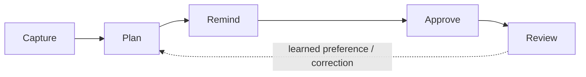
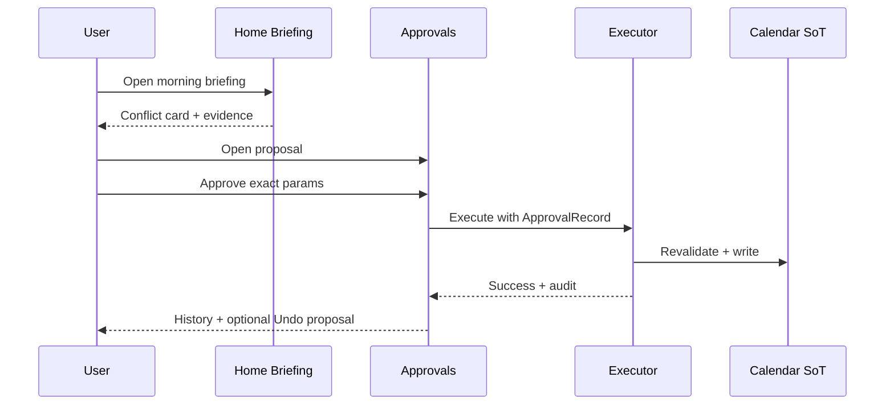

# User Journeys

**Issue:** [#28](https://github.com/TFT444/LifePilot/issues/28)  
**Product:** LifePilot daily-life MVP  
**Related:** [WIREFRAMES.md](WIREFRAMES.md), [ONBOARDING_PERMISSIONS.md](ONBOARDING_PERMISSIONS.md), [PROTOTYPE_VALIDATION.md](PROTOTYPE_VALIDATION.md)

LifePilot’s core loops are **capture → plan → remind → approve → review**. Every external write (Calendar or Reminders mutation) is **approval-gated**. This document maps happy paths, recovery, permission-denied, and offline variants, plus confirmation/undo for destructive and externally visible actions.

**Out of scope for these journeys:** finance/banking/shopping, HealthKit, Apple Mail ingestion or auto-send.

---

## Primary personas (working set)

Phase 1 `docs/product` personas may still land separately. Until then, journeys are validated against these **named primary personas** grounded in [PRODUCT_VISION.md](../PRODUCT_VISION.md):

| Persona | Snapshot | What they need from LifePilot |
|---|---|---|
| **Maya Chen** | Product manager; back-to-back work blocks + school pickup; calendar is dense Mon–Thu | Morning briefing that surfaces conflicts and travel buffers before she opens Calendar |
| **Jordan Okonkwo** | On-call nurse + evening courses; mixed personal/work contexts; often offline on commute | Offline task capture, reliable reminders, reconnect without redoing setup |
| **Alex Rivera** | Consultant who hops cities; Location + Weather matter for travel buffers | Explainable schedule moves; never silent calendar edits |
| **Sam Patel** | Self-employed designer; light calendar, heavy task queue; privacy-sensitive | Local-only mode; sensitive notification previews stay off; memory corrections they control |
| **Priya Nair** | Accessibility-first user (VoiceOver + larger Dynamic Type); Quiet Hours strictly kept | Plain-language copy; 44pt targets; no color-only status; quiet hours honored |

---

## Shared product rules (all journeys)

1. **Prepare, don’t perform.** Proposals show evidence and reason; execution requires explicit Approve.
2. **Least privilege.** Permission prompts appear only when a feature needs them — see [ONBOARDING_PERMISSIONS.md](ONBOARDING_PERMISSIONS.md).
3. **Offline-first.** LifePilot-owned tasks, memory, and preferences work without network; Calendar/Reminders sync when connected.
4. **Sensitive notification previews off by default.** Lock-screen copy stays generic unless the user opts in (Settings).
5. **No Mail auto-send.** Follow-ups may be manual/share-sheet only in later phases — not MVP journeys.

### Confirmation and undo contract

| Action class | Examples | Before commit | After commit |
|---|---|---|---|
| **Destructive (local)** | Delete all LifePilot data; delete memory item; clear completed tasks | Modal confirmation with consequence summary | Undo window (toast / snackbar) where reversible; irreversible deletes require typed confirm or dual step |
| **External write** | Create/update/delete Calendar event; create/complete Reminder | Approval sheet with exact parameters + evidence; editing params creates a **new** proposal | Audit entry; if reversible, offer “Undo” that queues a reverse proposal (also approval-gated) |
| **Preference change** | Quiet hours, briefing time, sensitive previews | Inline toggle (reversible) | Immediate apply; no confirmation noise |
| **Reject / dismiss proposal** | Reject conflict reschedule | Soft confirm only if irreversible learning would be implied; MVP: reject is undoable via History re-open where possible | Logged rejection; optional “don’t suggest this again” is explicit |

---

## Journey map

Screen references: [WIREFRAMES.md](WIREFRAMES.md).

---

## 1. Capture

**Goal:** Get something into LifePilot (or a connected system) with minimal friction from any screen.

### Happy path — Quick Capture (task)

1. User opens **Tasks** (or Search / Quick Capture sheet from Home).
2. Types a title; optional due date / list.
3. Confirms **Add** → task appears in Inbox/Today; persisted offline-first.
4. Optional: “Also create Reminder” becomes a **proposal** if Reminders are connected — not an immediate write.

**Persona check:** Sam (heavy tasks) and Jordan (commute capture) succeed in under ~5 seconds without Calendar permission.

### Recovery — empty / invalid input

- Empty title: Add disabled; inline hint “Add a short title.”
- Duplicate near-identical draft: soft banner “Similar task exists” with Open / Create anyway.

### Permission-denied — Reminders write refused

- User wanted system Reminder: app saves local task; shows “Reminders access is off — task saved in LifePilot. [Connect in Settings].”
- No system dialog re-prompt in-loop; Settings reconnect path only.

### Offline — capture still works

- Local task saves; sync/reminder proposal queues with `pending when online` badge.
- Briefing freshness: Capture does not block on network.

### Confirmation / undo

- Accidental add: swipe/undo on toast (10s) restores by deleting the new task locally.
- If a Reminder was already approved and written, Undo creates reverse proposal.

---

## 2. Plan

**Goal:** Arrange personal and work time; surface conflicts and preparation needs.

### Happy path — conflict spotted in briefing / timeline

1. Morning: **Home** shows briefing card “Overlap: Design review 2:00 and Pickup 2:15” with evidence (two events, buffer rule).
2. User opens proposal → explanation of why (overlap / insufficient travel buffer).
3. User edits suggested new time **or** accepts as-is → goes to Approvals queue / Approval sheet.
4. Approve → Executor writes Calendar change; Timeline and Home refresh.

**Dense day (Maya):** Multiple cards ranked; top conflict pinned in hero/prepared section.  
**Empty day (Sam):** Briefing focuses on overdue tasks and suggested focus blocks — not fake calendar noise.

### Recovery — stale proposal

- Event changed externally before approve: revalidation fails → “This proposal is out of date. [Refresh].”
- User not trapped; list updates without executing.

### Permission-denied — Calendar not authorized

- Planning still runs on LifePilot-owned events (if any) + tasks.
- Banner: “Calendar isn’t connected — conflict detection for system events is limited. [Connect].”
- No proposal that claims to mutate a calendar the user didn’t grant.

### Offline — plan with cached data

- Rules run on last-known events/tasks; freshness label “Updated earlier · offline.”
- External writes stay as proposals; Approve may be available but Execute waits for connectivity (or fails with retry).

### Confirmation / undo

- Approving a calendar move: Approval sheet is the confirmation.
- Undo: reverse-move proposal (approval-gated), never silent rewrite.

---

## 3. Remind

**Goal:** Right reminder at the right time without leaking sensitive lock-screen detail.

### Happy path — due soon

1. User sets due time on a task (or accepts “Remind me 30 min before” proposal).
2. At trigger: notification with **generic** body by default (“LifePilot reminder · 1 item”) unless sensitive previews enabled.
3. Tap → deep link to task detail / Today list.
4. Complete from notification action or in-app.

### Recovery — missed / overdue

- Overdue appears on Home + Tasks Today with signal (icon + text, not color alone).
- Snooze / reschedule via proposal if writing to system Reminders.

### Permission-denied — Notifications off

- In-app badges and Today list still work.
- Education card once: “Alerts are off — you’ll only see reminders inside LifePilot. [Open Settings].”
- Quiet Hours irrelevant if notifications denied; still respect in-app prominence reduction after evening if configured.

### Offline — local scheduling

- Local notification schedule when OS permits; otherwise show in-app due state when app next opens.
- No claim that a push was delivered if it wasn’t.

### Confirmation / undo

- Completing a system Reminder: if completion is an external write, it is approval-gated when initiated by LifePilot automation; user-initiated complete-from-UI may confirm once (“Mark done in Reminders?”) then execute under policy.
- Undo completion: restore open state + reverse write proposal if external.

---

## 4. Approve

**Goal:** User decides on every externally visible write; edited parameters require a new approval.

### Happy path — approve reschedule

1. **Approvals** (from Settings or Home deep link) lists pending proposals with title, detail, evidence.
2. User reviews reason → **Approve**.
3. Executor revalidates → executes → History shows success; AuditEvent recorded.
4. Affected Timeline row updates; briefing card dismisses.

### Happy path — reject

1. User taps **Reject** → optional one-line reason (MVP: optional).
2. Proposal moves to History as rejected; no external write.
3. Learning may use rejection later; never silences without user seeing it in Memory Review.

### Recovery — execution failure

- Network/EventKit error: error row, proposal returns to Pending or Failed with **Retry**.
- Partial failure never marks success.

### Permission-denied mid-approve

- Calendar revoked after propose, before execute: fail closed; message “Calendar access was revoked. Reconnect in Settings to continue.”
- Proposal remains; execute blocked.

### Offline — approve intent vs execute

- User may **Approve** (records intent) while offline if product policy allows queueing; UI labels “Approved · waiting to sync.”
- Or Approve disabled offline with explanation — **MVP preference:** allow approve, defer execute, show pending sync state (must never look like Calendar already changed).

### Confirmation / undo

- Approve/Reject buttons are the primary confirmations; destructive mass-approve is not offered in MVP.
- Undo after successful execute: “Undo” generates reverse proposal with its own Approve step.

---

## 5. Review

**Goal:** Inspect what LifePilot believes (memory, insights, audit) and correct it.

### Happy path — memory correction

1. **Memory**: user opens inferred “School pickup Wed/Fri” routine.
2. Edits or marks **Incorrect** → stored as `correction` provenance user-owned.
3. Future planning prefers correction; briefing cites updated preference when relevant.

### Happy path — insights glance

1. **Insights**: meeting load / focus / work–life when enough data.
2. Empty state until threshold: honest “Not enough schedule history yet.”
3. Tap insight → evidence list (which weeks/events), not opaque chart-only claim.

### Happy path — audit / history

1. Settings → Approvals → History: see approved/rejected/executed.
2. Export LifePilot data from Settings (local package).

### Recovery — bad inference

- One-tap “Forget this” / delete memory with confirmation.
- Does **not** delete Calendar source data.

### Permission-denied / partial signals

- Insights and memory still work on LifePilot-owned data.
- Weather/travel insights omitted with “Location/Weather not connected.”

### Offline — review local truth

- Memory, preferences, approval history from local store readable.
- Cloud Sync optional: review works fully local-only (Sam’s mode).

### Confirmation / undo

- Delete all LifePilot data: dual confirmation; irreversible warning; no silent wipe.
- Delete single memory: confirm + short undo toast.

---

## Cross-journey storyboard (golden path)

See also [PROTOTYPE_VALIDATION.md](PROTOTYPE_VALIDATION.md).

---

## Variant matrix

| Journey | Happy | Recovery | Permission-denied | Offline |
|---|---|---|---|---|
| Capture | Quick add task | Validation / near-dupe | Local save + Settings CTA | Local persist + queue |
| Plan | Conflict → proposal | Stale revalidation | Limited planning banner | Cached rules + freshness |
| Remind | Due notification / list | Overdue + snooze | In-app only + education | Local due state |
| Approve | Approve / reject | Exec fail + retry | Fail closed + reconnect | Intent vs sync label |
| Review | Correct memory / audit | Forget bad inference | Partial insights | Full local review |

---

## Persona validation notes

| Persona | Capture | Plan | Remind | Approve | Review |
|---|---|---|---|---|---|
| **Maya** | Secondary; prefers briefing-led | Primary — dense conflicts must rank | Prep reminders before school run | Must trust explain + one-tap approve | Skims insights weekly |
| **Jordan** | Primary — offline commute | Mixed shifts vs class | Notifications critical when on | Approves when back online | Quiet hours for nights |
| **Alex** | Travel buffers as tasks | Location/Weather enrich plan | Leave-by reminders | Rejects aggressive moves | Corrects places in Memory |
| **Sam** | Primary | Light calendar OK | Soft / in-app fine | Rare external writes | Local-only + memory hygiene |
| **Priya** | Large type capture field | Cards don’t rely on color | Quiet hours + non-sensitive previews | VO-friendly Approval sheet | Plain language insights |

**Gaps tracked:** formal PERSONAS.md sync; Health deferred (not tested here); Mail auto-send absent by design.

---

## Acceptance criteria checklist (#28)

- [x] Every journey has a happy path and recovery path
- [x] Permission-denied and offline variants are included
- [x] Destructive and externally visible actions show confirmation and undo behavior
- [x] Journeys are validated against all primary personas (working set above; sync when product personas land)
