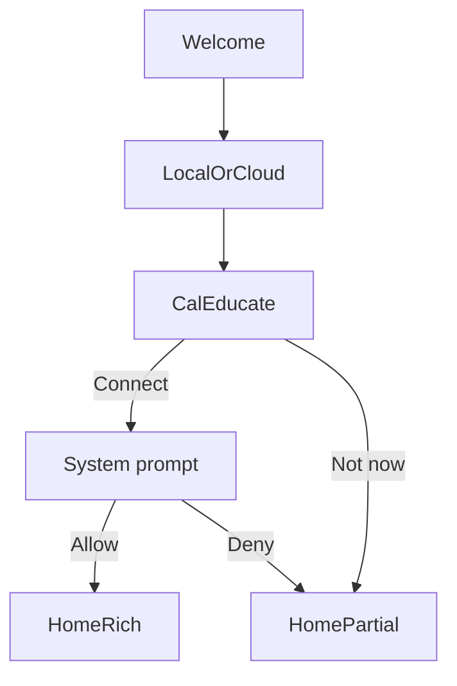
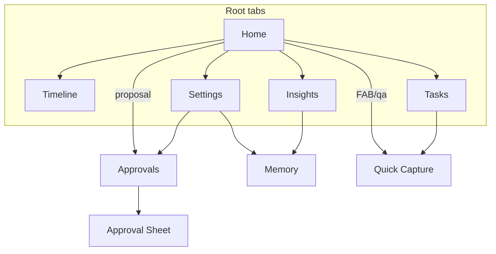

# Wireframes

**Issue:** [#31](https://github.com/TFT444/LifePilot/issues/31)  
**Journeys:** [USER_JOURNEYS.md](USER_JOURNEYS.md)  
**Onboarding:** [ONBOARDING_PERMISSIONS.md](ONBOARDING_PERMISSIONS.md)  
**Tokens:** [TOKENS_AND_LAYOUT.md](TOKENS_AND_LAYOUT.md)

Low-fidelity layouts for every MVP screen and system state. Fidelity goal: structure, hierarchy, and navigation — not visual polish.

**IA (MVP root tabs):** Home · Timeline · Tasks · Insights · Settings  
**Secondary / modal:** Approvals, Memory, Search / Quick Capture, Onboarding, Approval sheet.

---

## Journey → screen index

| Journey | Primary screens |
|---|---|
| Capture | Tasks, Search/Quick Capture, Home quick action |
| Plan | Home briefing, Timeline, Approval sheet |
| Remind | Tasks Today, Notification → task, Settings quiet hours |
| Approve | Approvals, Approval sheet, History |
| Review | Memory, Insights, Settings export/delete, Approvals History |

---

## Device notes

| Phone (compact) | Desktop / iPad (regular) |
|---|---|
| Single column; tab bar | Split where noted: list + detail |
| Sheets for capture and approvals | Popover / trailing inspector |
| Full-bleed navigation titles | Max readable measure ~720pt for settings forms |

---

## Onboarding and permissions

```
┌─────────────────────────┐
│  ○ ○ ○ ○ ○   progress   │
│                         │
│         [icon]          │
│     Connect Calendar    │
│  Reads your schedule to │
│  build briefings. Moves │
│  need your Approve.     │
│                         │
│  [ Connect Calendar ]   │
│  [ Not now ]            │
└─────────────────────────┘
```

Skip never dead-ends → Home with Connections banner. Full rules: ONBOARDING_PERMISSIONS.md.



---

## Home — Morning / anytime briefing

### Dense day (Maya)

```
┌─────────────────────────┐
│ Wed 15 Jul               │
│ Good morning, Maya      │
│ Fresh · 7:02a · Calendar│
├─────────────────────────┤
│ Prepared for you        │
│ ┌─────────────────────┐ │
│ │ ! Conflict          │ │
│ │ Review 2:00 overlaps│ │
│ │ pickup 2:15         │ │
│ │ Why: buffer rule    │ │
│ │ [ Review proposal ] │ │
│ └─────────────────────┘ │
│ ┌─────────────────────┐ │
│ │ Leave by 8:40       │ │
│ │ Weather: rain noon  │ │
│ └─────────────────────┘ │
│ Upcoming Schedule       │
│ 09:00 Standup           │
│ 11:00 1:1               │
│ 14:00 Design review  !  │
│ 14:15 Pickup         !  │
│ Quick actions           │
│ [Capture] [Approvals]   │
└─────────────────────────┘
         [Home Timeline Tasks Insights Settings]
```

### Empty day (Sam)

```
┌─────────────────────────┐
│ Good morning            │
│ Calendar light today    │
├─────────────────────────┤
│ Prepared for you        │
│ ┌─────────────────────┐ │
│ │ 3 tasks due         │ │
│ │ Suggested focus 10–12│
│ └─────────────────────┘ │
│ Upcoming                │
│ (empty state)           │
│ Nothing on calendar —   │
│ capture what matters.   │
└─────────────────────────┘
```

**Desktop:** Leading column = prepared + upcoming; trailing = selected card detail / inline approval.

---

## Timeline

```
┌─────────────────────────┐
│ Timeline          [Today]│
│ ─ Morning ──────────── │
│ 08:40  Leave-by signal  │
│ 09:00  Standup    Work  │
│ ─ Afternoon ────────── │
│ 14:00  Design     Work !│
│ 14:15  Pickup   Personal│
│ 15:00  Task: Invoice    │
└─────────────────────────┘
```

Dense: clustered rows + conflict glyphs (icon + text). Empty: single empty state “No events or tasks on this day.” Offline: top chip `Offline · showing cached`.

---

## Tasks and reminders

```
┌─────────────────────────┐
│ Tasks                   │
│ [Inbox|Today|Upcoming|Done]│
│ ┌──────────────┐ [Add]  │
│ │ Quick capture│        │
│ └──────────────┘        │
│ ○ Pack school bag       │
│ ○ Send roadmap draft    │
│ ✓ Buy oat milk          │
└─────────────────────────┘
```

Empty filter: EmptyStateView copy. Long list: standard list scroll; no card-in-card.

---

## Approvals

```
┌─────────────────────────┐
│ Approvals               │
│ Pending                 │
│ ┌─────────────────────┐ │
│ │ Move Design review  │ │
│ │ to 3:30 PM          │ │
│ │ Evidence: overlap…  │ │
│ │ [Approve] [Reject]  │ │
│ └─────────────────────┘ │
│ History                 │
│ Approved · synced 7:10a │
│ Rejected · keep 2:00    │
└─────────────────────────┘
```

### Approval sheet (modal / inspector)

```
┌─────────────────────────┐
│ Proposed action         │
│ Update calendar event   │
│ From 2:00 → 3:30        │
│ Why: …                  │
│ Evidence: …             │
│ [Approve]  [Reject]     │
│ Edit time → new proposal│
└─────────────────────────┘
```

Links: USER_JOURNEYS Approve.

---

## Memory

```
┌─────────────────────────┐
│ Memory                  │
│ Pinned                  │
│ ★ School pickup Wed/Fri │
│ Routines / Places       │
│ · Default buffer 15m    │
│ · Quiet hours 22–07     │
│ Corrections             │
│ · “Do not move 1:1s”    │
│ [Add preference]        │
└─────────────────────────┘
```

Empty: “Teach LifePilot a routine or place.” Delete → confirm. Entry from Settings and Insights evidence.

---

## Insights

```
┌─────────────────────────┐
│ Insights                │
│ This week               │
│ Meeting load   12h  ↑   │
│ Focus blocks    6h      │
│ After-hours    2h  !    │
│ Tap row → evidence list │
└─────────────────────────┘
```

Insufficient data:

```
│ Not enough schedule     │
│ history yet. Connect    │
│ Calendar or keep using  │
│ tasks for a few days.   │
```

No fake charts.

---

## Search / Quick Capture

```
┌─────────────────────────┐
│ Search                  │
│ [________________]      │
│ Results                 │
│ Task · Invoice draft    │
│ Event · Design review   │
│ Memory · School pickup  │
├─────────────────────────┤
│ Quick Capture           │
│ Title […]  Due […]      │
│ [Save task]             │
└─────────────────────────┘
```

Offline: local results only; caption “Offline search.”

---

## Settings

```
┌─────────────────────────┐
│ Settings                │
│ Briefing                │
│  Hour 7:00              │
│ Privacy                 │
│  Sensitive previews OFF │
│  Quiet hours 22–07      │
│ Actions                 │
│  Approvals >            │
│ Connections             │
│  Calendar    Authorized │
│  Reminders   Not asked  │
│  Notifications Denied   │
│  Location    Not asked  │
│  Weather     —          │
│  Cloud Sync  Off        │
│ Your data               │
│  Memory · Export · Delete│
│ About                   │
│  MVP scope note         │
└─────────────────────────┘
```

---

## System states (all major surfaces)

### Loading

```
┌─────────────────────────┐
│ Good morning            │
│ ░░░░░░░░░░░░░░░░░░      │  ← LoadingSkeleton / LoadingCardSkeleton
│ ░░░░░░░░░░              │     (static if Reduce Motion)
└─────────────────────────┘
```

### Empty

Use `EmptyStateView` — icon + one sentence + optional CTA (Capture / Connect).

### Error

```
│ Couldn’t refresh        │
│ Calendar. Showing last  │
│ good data. [Retry]      │
```

### Offline

Top-of-screen non-modal chip + degraded CTAs (Approve may queue; never implies external write completed).

### Permission-denied banner

```
│ Calendar access is off. │
│ Conflict checks are     │
│ limited. [Settings]     │
```

---

## Navigation map



---

## Phone vs desktop — Approvals example

### Phone

```
List full width → tap row → sheet with Approve/Reject
```

### Desktop

```
┌──────────────┬──────────────────┐
│ Pending list │ Detail + evidence│
│              │ [Approve][Reject]│
└──────────────┴──────────────────┘
```

---

## Acceptance criteria checklist (#31)

- [x] All MVP screens have wireframes
- [x] Dense workdays, empty days, and long-content cases are represented
- [x] Phone and desktop adaptations are shown
- [x] Wireframes link together into the primary user journeys
