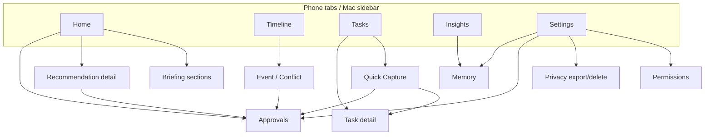

# LifePilot Information Architecture

**Issue:** [#24](https://github.com/TFT444/lifepilot/issues/24)  
**Status:** Complete for daily-life MVP planning  
**Last updated:** 2026-07-15  
**Scope baseline:** [`docs/IMPLEMENTATION_STATUS.md`](../IMPLEMENTATION_STATUS.md), [`.cursor/rules/lifepilot-mvp.mdc`](../../.cursor/rules/lifepilot-mvp.mdc)

LifePilot is one app that unifies personal reminders, events, work schedules, tasks, briefings, approvals, memory, and insights. This document names every core screen and secondary flow, how contexts (personal / work / shared / private) appear without fragmenting navigation, and how phone and macOS adapt the same destinations.

**Out of scope for destinations:** finance/banking/shopping surfaces, HealthKit medical MVP, Apple Mail inbox ingestion, and automatic message sending.

---

## 1. Design principles

1. **One composition, one loop.** Primary UX is Observe → Understand → Predict → Prepare → Explain → Approve → Execute → Learn — not a multi-app dashboard.
2. **Offline-first.** LifePilot-owned tasks, preferences, recommendations, approvals, and audit events work without network. Calendar and Reminders remain sources of truth when connected.
3. **Approval-gated external writes.** No Calendar/Reminders/Notification mutation reaches execution without `ActionProposal` → explicit user Approval → Executor.
4. **Least privilege.** Permissions are requested at the feature that needs them; denial never traps the user.
5. **Contexts without mode switching.** Personal, work, shared, and private are filters and badges on a unified Timeline/Home — not separate apps or root tabs.
6. **Named destinations.** Every MVP surface has a stable route id (see §6) for deep links, widgets, and tests.

---

## 2. Context model (personal / work / shared / private)

Contexts tag entities; they do **not** split the root navigation.

| Context | Meaning | Visible when | Default privacy |
|---|---|---|---|
| **Personal** | User’s own life: errands, personal events, home routines | Always | Normal lock-screen previews allowed unless marked private |
| **Work** | Job / school / shifts, buffers, work-hours rules | Always; filterable | Prefer non-sensitive titles on lock screen when Quiet Hours on |
| **Shared** | Items involving other people (family pickup, team standup) — metadata only in MVP; no group accounts | Filter + badge | Titles may omit other people’s names in notifications |
| **Private** | Explicitly sensitive (therapy, legal, confidential 1:1) | Filter; redacted in Insights export by default | Lock-screen redaction; Search requires Face ID / device unlock when Privacy Lock is on |

### How context appears in UI

- **Home / Briefing:** Sections can mix contexts; conflict cards always show both sides’ contexts.
- **Timeline:** Chip filter row: All | Personal | Work | Shared | Private (multi-select).
- **Tasks:** Same chips + list buckets (Inbox / Today / Upcoming / Completed).
- **Approvals:** Context badge on each proposal; private proposals hide detail until expanded.
- **Memory / Insights:** Preferences and patterns labeled by context; private signals never appear in share sheets.
- **Settings → Privacy:** Per-context notification preview rules and export include/exclude.

There is no separate “Work app” or “Family app” tab in MVP.

---

## 3. Root navigation

### 3.1 Phone (iPhone / compact iPad)

Five root tabs, each owning an independent `NavigationStack` (matches `AppTab` / `RootTabView`):

| Tab | Route root | Primary job |
|---|---|---|
| **Home** | `home` | Morning / anytime briefing, prep cards, approval callouts |
| **Timeline** | `timeline` | Unified chronological day/week across events, shifts, tasks due |
| **Tasks** | `tasks` | Capture, lists, reminders (LifePilot-owned; EventKit when connected) |
| **Insights** | `insights` | Patterns, overload, preparation stats (evidence-backed) |
| **Settings** | `settings` | Permissions, privacy, sync, Memory entry, Approvals entry, export/delete |

**Global affordances (not tabs):**

| Affordance | When | Destination |
|---|---|---|
| Quick Capture | FAB / toolbar / App Intent / widget | `capture` modal |
| Search | Toolbar magnifier on Home, Timeline, Tasks, Insights | `search` |
| Approvals badge | Pending count on Home + Settings row | `approvals` |
| Memory | Settings → Memory, or Insights drill-down | `memory` |

### 3.2 macOS / regular width

Same destinations; different chrome:

| Adaptation | Behavior |
|---|---|
| **Sidebar** | Persistent list: Home, Timeline, Tasks, Approvals, Memory, Insights, Settings. Approvals and Memory promoted out of Settings nesting when width ≥ regular. |
| **Detail column** | Selected entity (task / event / proposal / memory note) opens in split view, not only push. |
| **Toolbar** | Quick Capture, Search (⌘K), Context filter, Refresh / offline indicator. |
| **Menu bar** | LifePilot → New Task / Reminder / Event (local), Open Briefing, Open Approvals, Preferences. |
| **Window restore** | Restores last root destination + selected entity route. |
| **Keyboard** | ⌘1–⌘7 map to sidebar roots; ⌘N capture; ⌘. dismiss modal. |

Phone tabs map 1:1 to sidebar roots; Approvals and Memory remain first-class on Mac even though phone often nests them under Settings for tab budget.

---

## 4. Core screens and named destinations

Convention: `lifepilot://{path}` (deep link) and Swift `AppRoute` enum case of the same name.

### 4.1 Launch and onboarding

| Destination ID | Screen | Purpose |
|---|---|---|
| `splash` | Splash | Brand + cold-start gate |
| `onboarding.root` | Onboarding flow | Value props; local-first vs optional account |
| `onboarding.permissions.calendar` | Calendar education | Explain before system prompt |
| `onboarding.permissions.reminders` | Reminders education | Explain before system prompt |
| `onboarding.permissions.notifications` | Notifications education | Explain before system prompt |
| `onboarding.permissions.location` | Location education (optional) | Travel/weather prep only |
| `onboarding.complete` | Done | Routes to `home` |
| `onboarding.skip` | Skip path | Continues with reduced features; no trap |

Health / Mail connection steps are **not** MVP destinations.

### 4.2 Home / Briefing

| Destination ID | Screen | Purpose |
|---|---|---|
| `home` | Home / Today | Root briefing surface |
| `home.briefing` | Morning Briefing | Ranked prep for today (store + planning backed) |
| `home.briefing.section.schedule` | Section | Timeline slice + conflicts |
| `home.briefing.section.tasks` | Section | Due / overdue / focus set |
| `home.briefing.section.travel` | Section | Optional weather / travel prep (graceful if denied) |
| `home.briefing.section.approvals` | Section | Pending proposals needing attention |
| `home.recommendation.{id}` | Recommendation detail | Evidence, freshness, reason, Approve / Edit / Dismiss |
| `home.freshness` | Freshness/partial state | Shows stale / offline / partial data banners |
| `home.empty` | Empty day | Guidance to capture or connect calendar |

### 4.3 Timeline

| Destination ID | Screen | Purpose |
|---|---|---|
| `timeline` | Timeline root | Unified day (default) |
| `timeline.day` | Day view | Chronological blocks |
| `timeline.week` | Week view | Density / overload glance |
| `timeline.item.event.{id}` | Event detail | Personal/work event or shift |
| `timeline.item.task.{id}` | Task peek | Due item on timeline |
| `timeline.conflict.{id}` | Conflict card | Overlap / buffer / travel clash resolution |
| `timeline.filter` | Context filters | Personal/work/shared/private |
| `timeline.empty` | Empty timeline | Connect calendar or add event |
| `timeline.offline` | Offline | Cached store contents only |

### 4.4 Tasks / Reminders

| Destination ID | Screen | Purpose |
|---|---|---|
| `tasks` | Tasks root | Default: Today |
| `tasks.inbox` | Inbox | Unscheduled / unsorted |
| `tasks.today` | Today | Due today + flagged |
| `tasks.upcoming` | Upcoming | Future due dates |
| `tasks.completed` | Completed | Archive / undo complete |
| `tasks.detail.{id}` | Task detail | Subtasks, tags, recurrence, context |
| `tasks.edit.{id}` | Edit task | Local write; external write needs approval if EventKit-linked |
| `tasks.reminder.{id}` | Reminder detail | Notification schedule |
| `tasks.empty.{list}` | Empty list | Capture CTA |
| `capture` | Quick Capture modal | Task / reminder / local event draft |
| `capture.task` | Capture → Task | |
| `capture.reminder` | Capture → Reminder | |
| `capture.event` | Capture → Event draft | Approval required before writing Calendar |

### 4.5 Approvals

| Destination ID | Screen | Purpose |
|---|---|---|
| `approvals` | Approvals inbox | Pending ActionProposals |
| `approvals.detail.{id}` | Proposal detail | Diff of intended external write + evidence |
| `approvals.approve.{id}` | Confirm approve | Explicit tap; revalidation before execute |
| `approvals.reject.{id}` | Reject | With optional reason → learn |
| `approvals.edit.{id}` | Edit then approve | Amend proposal fields |
| `approvals.history` | Audit history | Past approvals / executions / failures |
| `approvals.empty` | Empty | “Nothing needs your approval” |
| `approvals.failed.{id}` | Execution failure | Retry / cancel / open recovery |

No destination auto-sends email or mutates systems without this flow.

### 4.6 Memory

| Destination ID | Screen | Purpose |
|---|---|---|
| `memory` | Memory root | Preferences, routines, learned constraints |
| `memory.preference.{id}` | Preference detail | Editable life/work preference |
| `memory.routine.{id}` | Routine | Recurring pattern the user confirmed |
| `memory.correction` | Correction flow | “Don’t suggest this again” → preference write |
| `memory.empty` | Empty | Explain how Memory learns from approvals |
| `memory.export` | Export preferences | Local file; respects private exclusion |

### 4.7 Insights

| Destination ID | Screen | Purpose |
|---|---|---|
| `insights` | Insights root | Evidence-backed patterns (not vanity charts) |
| `insights.overload` | Overload | Buffer / work-hours / density patterns |
| `insights.prep` | Preparation | Missed prep vs followed recommendations |
| `insights.approvals` | Approval quality | Accept / edit / reject rates |
| `insights.empty` | Empty / insufficient data | Honest empty — no fake charts |
| `insights.placeholder` | Current ship state | Present until evidence UI lands (see IMPLEMENTATION_STATUS Stage 8) |

### 4.8 Search

| Destination ID | Screen | Purpose |
|---|---|---|
| `search` | Search root | Offline search of LifePilot-owned + cached entities |
| `search.results` | Results | Tasks, events, proposals, memory notes |
| `search.empty` | No results | Suggestions to broaden filters |
| `search.unavailable` | Index cold/unavailable | Retry; still allow capture |

### 4.9 Settings, permissions, privacy, recovery

| Destination ID | Screen | Purpose |
|---|---|---|
| `settings` | Settings root | Hub |
| `settings.permissions` | Permissions | Calendar, Reminders, Notifications, Location (optional) |
| `settings.permissions.calendar` | Calendar detail | Status, reconnect, reduced-capability copy |
| `settings.permissions.reminders` | Reminders detail | Same |
| `settings.permissions.notifications` | Notifications detail | Quiet hours, preview sensitivity |
| `settings.permissions.location` | Location detail | Optional travel; skip-safe |
| `settings.privacy` | Privacy | Contexts, lock, export include rules |
| `settings.privacy.export` | Export data | User-owned data package |
| `settings.privacy.delete` | Delete local data | Destructive confirm + undo window where safe |
| `settings.sync` | Sync | Local-only vs optional CloudKit (additive) |
| `settings.account` | Account | Local-only default; optional sign-in post-MVP soft |
| `settings.about` | About | Version, licenses, security summary |
| `settings.approvals` | Jump to Approvals | Phone nesting |
| `settings.memory` | Jump to Memory | Phone nesting |
| `settings.resetOnboarding` | Reset onboarding | For material onboarding version bumps |
| `recovery.offline` | Offline banner / sheet | Explains cached mode |
| `recovery.partial` | Partial data | Which sources failed |
| `recovery.permissionDenied` | Capability reduced | Pathway to Settings |
| `recovery.corruptState` | Safe fallback | Rebuild stores; preserve export if possible |
| `recovery.executorError` | Write failed after approve | Idempotent retry guidance |

---

## 5. Secondary flows (end-to-end)

| Flow | Entry | Happy path destinations | Recovery / denial |
|---|---|---|---|
| Morning review | Launch / notification | `home.briefing` → optional `approvals.detail` → `timeline` | `home.freshness`, `recovery.offline` |
| Quick capture | Any root + FAB | `capture` → `tasks.detail` or approval if external | Stay on source if cancel |
| Conflict resolve | Timeline / Briefing | `timeline.conflict` → proposal → `approvals` | Reject → Memory correction |
| Connect calendar later | Empty Timeline / Settings | `settings.permissions.calendar` → system prompt | Deny → `recovery.permissionDenied` |
| Approve calendar write | Recommendation / Capture event | `approvals.detail` → approve → executor | `approvals.failed` |
| Review memory | Insights / Settings | `memory` → edit preference | Empty education |
| Privacy lock search | Search with Private items | Auth gate → `search.results` | Cancel → redacted list |
| Delete all data | Settings | `settings.privacy.delete` → confirm | Cancel; no auto cloud wipe beyond user intent |

Communication of approved plans to others (if any) is **manual share sheet / copy**, never automatic Mail send. There is no `mail.compose.auto` destination.

---

## 6. Destination catalog (complete MVP set)

Every Phase 4–7 user-facing surface maps here:

| Area | Destination IDs |
|---|---|
| Launch | `splash`, `onboarding.*`, `onboarding.skip` |
| Home | `home`, `home.briefing`, `home.briefing.section.*`, `home.recommendation.*`, `home.freshness`, `home.empty` |
| Timeline | `timeline`, `timeline.day`, `timeline.week`, `timeline.item.*`, `timeline.conflict.*`, `timeline.filter`, `timeline.empty`, `timeline.offline` |
| Tasks | `tasks`, `tasks.inbox/today/upcoming/completed`, `tasks.detail/edit/reminder.*`, `tasks.empty.*`, `capture`, `capture.*` |
| Approvals | `approvals`, `approvals.detail/approve/reject/edit/history/empty/failed.*` |
| Memory | `memory`, `memory.preference/routine/correction/empty/export` |
| Insights | `insights`, `insights.overload/prep/approvals/empty/placeholder` |
| Search | `search`, `search.results/empty/unavailable` |
| Settings | `settings`, `settings.permissions.*`, `settings.privacy.*`, `settings.sync/account/about`, nests to Approvals/Memory |
| Recovery | `recovery.offline/partial/permissionDenied/corruptState/executorError` |

Agent-owned surfaces (Calendar / Tasks / Travel / Weather / Memory capabilities) surface **through** Home, Timeline, Approvals, and Memory — they do not get separate root tabs.

---

## 7. Empty, search, permissions, and recovery entry points

| State | Primary entry | Secondary entry | User outcome |
|---|---|---|---|
| Empty Home | First launch after onboarding | Day with no events/tasks | Capture + optional connect calendar |
| Empty Timeline | No events in range | Calendar denied | Local events only + permission education |
| Empty Tasks lists | New user / cleared inbox | — | Capture CTA |
| Empty Approvals | No pending proposals | — | Confidence copy, not dead end |
| Empty Insights | Insufficient evidence | — | Honest empty (no fake metrics) |
| Empty Memory | No confirmed preferences | — | How learning works |
| Search no hits | Query | — | Broaden / capture |
| Permission denied | Feature that needs it | Settings → Permissions | Reduced mode + reconnect |
| Offline | Any root banner | Home freshness | Local stores continue |
| Partial sources | Banner on Home/Timeline | Recovery sheet | Show which signals missing |
| Corrupt persistence | Launch | Settings recovery | Safe rebuild + export path |
| Executor failure | Approvals | Notification deep link | Retry / dismiss with audit |

---

## 8. Navigation map (mermaid)

---

## 9. Alignment with current code

| IA area | Code today (2026-07-15) |
|---|---|
| Tabs Home / Timeline / Tasks / Insights / Settings | `AppShell/Navigation/AppTab.swift`, `RootTabView.swift` |
| Splash / Onboarding | `Features/Splash`, `Features/Onboarding` |
| Approvals UI | `Features/Approvals` (reachable via Settings) |
| Memory view stub | `Features/Memory` |
| Insights placeholder | `Features/Insights` |
| Typed deep links / Search / Mac sidebar | Tracked by [#36](https://github.com/TFT444/lifepilot/issues/36); destinations defined here first |

---

## Acceptance criteria checklist (issue #24)

- [x] Information architecture document is committed under `docs/` (`docs/product/INFORMATION_ARCHITECTURE.md`)
- [x] Every planned core screen and agent-owned surface has a named location (destination catalog §4–§6)
- [x] Navigation map covers phone and macOS adaptations (§3)
- [x] No Phase 4–7 deliverable is left without a user-facing destination (§6; Approvals, Memory, Insights, Search, Settings, recovery included)
- [x] Personal / work / shared / private contexts documented without fragmenting root nav (§2)
- [x] Empty, search, permissions, and recovery entry points documented (§7)
- [x] Scope respects offline-first, approval-gated writes, and exclusion of finance / HealthKit MVP / Mail auto-send
