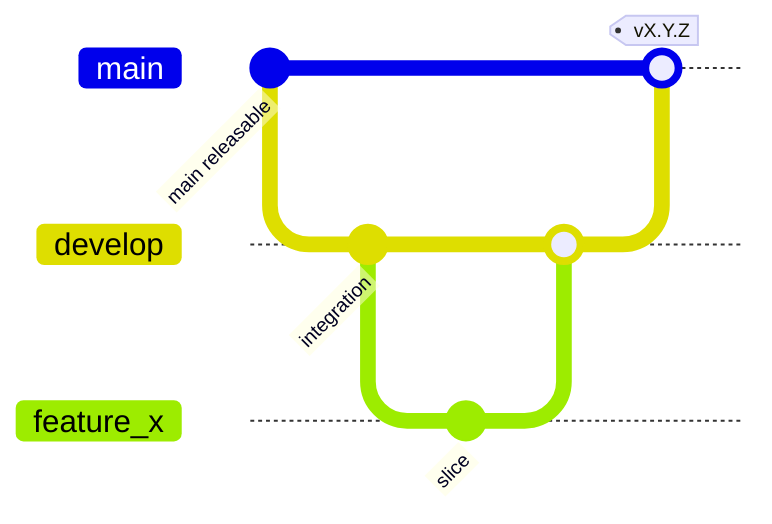

# LifePilot Repository Reconciliation

**Issue:** [#27](https://github.com/TFT444/lifepilot/issues/27)  
**As of:** 2026-07-15  
**Scope:** Restore one trustworthy source of truth for branch flow, overlapping PRs, and stale completed issues — without inventing merge outcomes that have not happened yet.

Related: [`CONTRIBUTING.md`](../../CONTRIBUTING.md), [`README.md` Branch Strategy](../../README.md#branch-strategy), [`docs/SOLO_MAINTAINER_REVIEW.md`](../SOLO_MAINTAINER_REVIEW.md), [`APPROVAL_POLICY.md`](../../APPROVAL_POLICY.md).

---

## 1. Intended branch flow (Git Flow)

LifePilot uses classic Git Flow:



| Branch | Role | Rules |
|---|---|---|
| `main` | Production-ready, demo/release surface | Protected; no direct commits; updated via release merge from `develop` or `hotfix/*` |
| `develop` | Default integration branch | All `feature/*`, `fix/*`, `cursor/*`, `docs/*`, `chore/*` PRs target `develop` |
| `feature/*` / `cursor/*` | One concern, one PR | Cut from latest `develop`; squash-merge back to `develop` |
| `release/*` | Stabilize a version | Cut from `develop`; merge to `main` + back to `develop` |
| `hotfix/*` | Urgent production fix | Cut from `main`; merge to `main` **and** `develop` |
| `gh-pages` | Static demo hosting artifact | Deploy workflow only; not for app feature work |

**Cursor agent convention:** work on `cursor/*` or `feature/*` — never commit directly to `main` or `develop` (see `.cursor/rules/lifepilot-mvp.mdc`).

**Solo maintainer reviews:** required GitHub reviews may be satisfied by Cursor Bugbot + Approval Agents as `cursor` when CI is green and scope policy passes (PR #40 merged; issue #7). Human remains accountable for product judgment.

---

## 2. Current divergence: `main` vs `develop` (2026-07-15)

### 2.1 Facts

| Observation | Evidence |
|---|---|
| `develop` is ahead of `main` with engineering + demo CI wiring | e.g. PR #40 merge `f1ccc15`, interactive demo commits from develop history (`#19` path), SPM app foundation |
| `main` contains commits **not** in `develop` | Hackathon demo path `demo/index.html` and related merges (#17, #21); Dependabot bumps landed on `main` lineage |
| Diff `origin/develop...origin/main` (file tip) | Primarily `demo/index.html` (~1062 lines) plus small workflow path tweaks |
| Live web demo / Vercel / Pages | Historically painful; overlapping fix PRs #16, #20, #22, #23 |

### 2.2 Intended relationship after reconciliation

1. **`develop` is the source of truth for application code, Core/Features, and product docs.**
2. **`main` should become a release snapshot of `develop`**, plus only intentionally published demo hosting config.
3. **Hackathon `demo/index.html` on `main`:** treat as legacy promo. Prefer the maintained `Website/public/` (and/or documented Pages workflow from develop). Do not let `demo/` drift become a second product.
4. **Until a release PR merges `develop` → `main`:** feature PRs keep targeting `develop`; do not open new feature work against `main` except hotfix or demo-hosting fixes that immediately backport.

### 2.3 Recommended merge sequence (maintainer actions)

These are **documented intents** for #27 completion; they require human/bot approvals and branch protection.

| Step | Action | Result |
|---|---|---|
| A | Land or supersede deploy/architecture unify PR into `develop` (see §3 PR #23) | develop has one demo+architecture baseline |
| B | Close duplicate PRs that are fully contained or obsolete (§3) | No duplicate open work |
| C | Open `release/*` or sync PR: merge `develop` → `main` with release notes | main ⊆ develop for app code |
| D | If `demo/index.html` still needed on Pages, either (i) generate from `Website/public` in workflow, or (ii) one-time commit on release branch with explicit note — avoid two demos | Single demo source of truth |
| E | Re-confirm CI green on both branch heads | Acceptance for #27 |

**CI note:** Cloud Linux agents cannot run Xcode; trust GitHub Actions macOS checks on PR heads.

---

## 3. Pull request status (as of 2026-07-15)

| PR | Title | Base ← Head | State | CI (observed) | Reconciliation recommendation |
|---|---|---|---|---|---|
| [#16](https://github.com/TFT444/lifepilot/pull/16) | feat(web): interactive LifePilot product demo | `develop` ← `cursor/interactive-web-demo-4d5a` | **OPEN** | Build/Lint/Format/Tests/CI Status green; merge state BEHIND | **Likely obsolete / close.** Interactive demo later merged via [#19](https://github.com/TFT444/lifepilot/pull/19) into develop. Confirm file overlap (`Website/public/`); if contained, close #16 with comment linking #19. |
| [#20](https://github.com/TFT444/lifepilot/pull/20) | fix: deployment, architecture drift, and documentation gaps | `develop` ← `cursor/fix-all-issues-4d5a` | **OPEN** | Checks green (rollup) | **Supersede via #23.** PR #23 body states it combines #20 + main demo sync. Close #20 when #23 merges (or close now if #23 already contains all commits). |
| [#22](https://github.com/TFT444/lifepilot/pull/22) | fix(web): serve LifePilot demo on Vercel and GitHub Pages | `main` ← `cursor/fix-demo-deploy-4d5a` | **OPEN** | Checks green; merge **BLOCKED** (protection/review) | **Resolve carefully.** Targets `main` while develop diverges. Prefer: (1) ensure equivalent hosting fixes exist on develop (#23), (2) either merge as hotfix+backport or close and ship hosting via develop→main release. Do not leave forever-open. |
| [#23](https://github.com/TFT444/lifepilot/pull/23) | fix: unify develop — architecture fixes, deploy, and main demo sync | `develop` ← `cursor/sync-main-develop-4d5a` | **OPEN** | Checks green | **Primary unify PR for develop.** Merge (with Bugbot/Approval Agent) then close #20. Already partially consumed conceptually by daily-life work; verify before merge that it doesn’t fight PR #39. |
| [#39](https://github.com/TFT444/lifepilot/pull/39) | feat: daily-life MVP — scope correction, offline stores, planning, Tasks | `develop` ← `cursor/daily-life-mvp-4d5a` | **OPEN** | All green as of post-`9dacae4` / IMPLEMENTATION_STATUS | **Keep open; primary feature PR.** Base should be refreshed after #23/#40. Merge when approval policy satisfied. Do not merge to `main` directly. |
| [#40](https://github.com/TFT444/lifepilot/pull/40) | chore: Cursor Bugbot + Approval Agent for solo-maintainer PR reviews (#7) | `develop` ← `cursor/solo-pr-reviewer-4d5a` | **MERGED** 2026-07-15 | Was green | **Done.** Enables solo-maintainer merge path; supporting docs in repo. Issue #7 may remain open until dashboard wiring verified by human. |

### 3.1 Overlap summary

```text
#16  demo feature  ──(largely landed as #19)──► close duplicate
#20  arch+deploy   ──(folded into #23)───────► close after #23
#22  pages/vercel on main ──(coordinate with #23 + release)──► merge or close+recreate on release
#23  unify develop ◄── canonical for deploy/architecture sync
#39  daily-life MVP ◄── canonical for product scope correction
#40  review tooling ── MERGED
```

**Acceptance target:** no open PR that solely duplicates already-merged work (#16 vs #19 is the clearest case).

---

## 4. Stale issues #3 and #4 — evidence and close recommendation

### 4.1 Issue [#3](https://github.com/TFT444/lifepilot/issues/3) — SwiftLint / SwiftFormat configs

| Acceptance item | Evidence | Met? |
|---|---|---|
| Add `.swiftlint.yml` reflecting Style Guide | File present at repo root; tuned rules (line length 120/160, opt-ins, module includes) | Yes |
| Add `.swiftformat` matching 4-space / 120 soft limit | File present at repo root | Yes |
| Both run cleanly against real Swift targets | `.github/workflows/lint.yml` runs `swiftlint lint --strict` and `swiftformat --lint .`; PR #39 CI SwiftLint + SwiftFormat Check **SUCCESS** | Yes |

**Landed with:** early package/CI work (e.g. history through Phase 3 scaffold / #6 / #14 lineages).  
**Recommendation:** **Close #3 as completed** with a comment linking this document and the config file paths. Leave open only if Style Guide parity audit is explicitly still desired — that would be a *new* follow-up issue, not the original missing-config request.

### 4.2 Issue [#4](https://github.com/TFT444/lifepilot/issues/4) — Xcode project + CI workflows

| Acceptance item | Evidence | Met? |
|---|---|---|
| Create LifePilot Xcode project/scheme | `App/LifePilot.xcodeproj` exists; `release.yml` references `-project App/LifePilot.xcodeproj -scheme LifePilot` | Yes |
| CI Build job passes | `.github/workflows/ci.yml` (`swift build`) green on recent PRs | Yes |
| Unit Tests job passes | `.github/workflows/test.yml` (`swift test`) green on recent PRs | Yes |
| Lint jobs pass | lint.yml + PR checks green | Yes |
| Branch protection required checks updated if names changed | Solo-maintainer path documented (#40); exact GitHub settings are repo-admin UI — verify in GitHub Settings → Branches | Admin verify |

**Landed with:** PR [#6](https://github.com/TFT444/lifepilot/pull/6) / Phase 3 foundation [#14](https://github.com/TFT444/lifepilot/pull/14) (`feat: scaffold` / SwiftUI foundation).  
**Recommendation:** **Close #4 as completed** after a quick admin glance that branch protection still lists current check names (Build, Unit Tests, SwiftLint, SwiftFormat Check, CI Status). If protection names differ, fix protection in the same pass — still #4 follow-through, then close.

---

## 5. How agents and humans should work until sync finishes

1. Branch from **`origin/develop`**, not `main`.
2. Prefer stacking on **#39** for daily-life MVP scope; avoid reintroducing finance/health/mail-send.
3. Do not open additional “fix all demo issues” PRs; contribute to #23 or a single follow-up.
4. After `develop`→`main` release, delete stale remote `cursor/*` branches that are merged or closed.
5. Update [`IMPLEMENTATION_STATUS.md`](../IMPLEMENTATION_STATUS.md) verification log when CI evidence changes.

---

## 6. Definition of done for issue #27

| Criterion | Status as of 2026-07-15 |
|---|---|
| Intended branch flow documented | **Done** (this doc §1) |
| main/develop relationship intentional and documented | **Documented** (§2); **mechanical sync still pending** maintainer merge |
| Overlapping PRs resolved or clearly scheduled | **Scheduled** (§3); close/merge actions remain |
| #3 / #4 closed with evidence | **Recommend close** (§4); closing is maintainer action |
| CI passes on resulting branch heads | **Green on open PR heads** (#39 etc.); both default branches after sync still TBD |

---

## Acceptance criteria checklist (issue #27)

- [x] `main` and `develop` have an intentional documented relationship (§2)
- [x] Open PR duplicates are identified with close/merge recommendations; no silent duplicate retention plan (§3) — *execution of closes/merges tracked for maintainer*
- [x] Stale completed issues #3 and #4 documented with evidence and close recommendation (§4)
- [x] Intended Git Flow branch flow documented (§1)
- [ ] CI passes on the **resulting** branch heads after sync merges — *blocked on maintainer completing §2.3 steps; current open PR heads are green*

When §2.3 A–E complete, mark the final checkbox and close issue #27.
